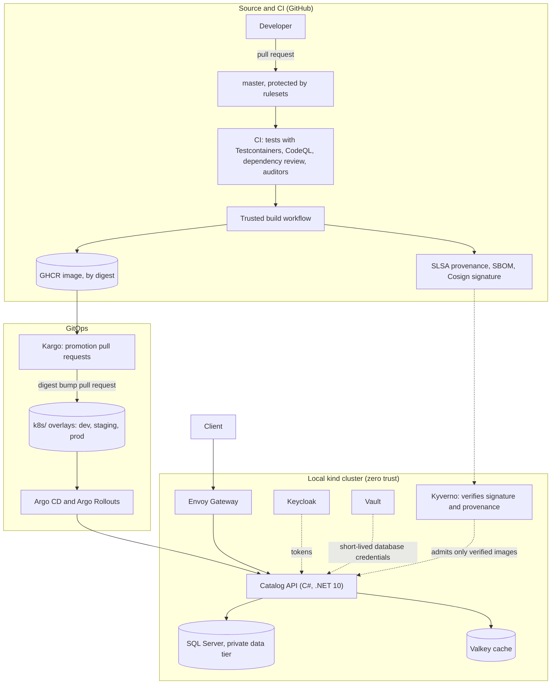
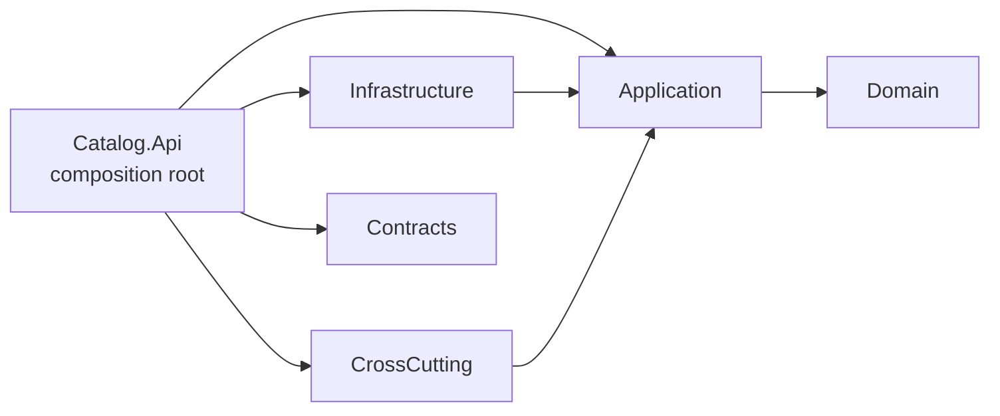

# Secure Product Catalog Platform

[](https://github.com/RostomOhannessian/full-ci-cd-pipeline/actions/workflows/docs.yml)
[](LICENSE)

> **Work in progress.** This repository is in Phase 0: the plan, the decisions, and the documentation foundation are here, and the application starts in Phase 1.
> The live state is on [the status page](docs/project/STATUS.md). Nothing here is ready to deploy yet, and the roadmap below says when each part arrives.

A .NET 10 product-catalog API built with Clean Architecture, delivered through a signed and attested supply chain onto a local zero-trust Kubernetes platform, and promoted from dev to staging to prod with GitOps. Every phase ships working code, tests, and documentation together.

The repository has three equal purposes:

- **Learn.** It is the author's deliberate learning path through modern secure delivery.
- **Teach.** Every tool has a page with an overview, the decision rationale, a setup tutorial, and external sources. You are expected to know the syntax of C#, YAML, HCL, PowerShell, and shell. You are not expected to know the tools.
- **Show.** It is a public engineering portfolio that demonstrates production judgment: decisions are recorded, claims are dated and sourced, and every requirement traces to a test.

## What it demonstrates

| Pillar | What you will find | Tools (examples) |
| --- | --- | --- |
| Clean Architecture | Domain, Application, Infrastructure, CrossCutting, Contracts, and Api projects with enforced dependency rules, CQRS without a mediator, repository and unit of work, domain events with a transactional outbox | .NET 10, EF Core, FluentValidation, FusionCache |
| Zero-trust identity | OIDC everywhere, no long-lived secrets, short-lived database credentials, policy-based authorization | Keycloak, HashiCorp Vault, GitHub OIDC |
| Shift-left supply chain | Tests, static analysis, dependency review, image scanning, SBOMs, provenance, and keyless signing, all verified again at admission | CodeQL, Trivy, Syft, GitHub attestations, Cosign, Kyverno |
| GitOps | Declarative desired state under `k8s/`, one signed digest promoted through dev, staging, and prod with canary analysis and rehearsed rollback | Argo CD, Argo Rollouts, Kargo |
| Contract-first integration | An authored, versioned OpenAPI contract, consumer-driven Pact tests, breaking-change gates | OpenAPI, oasdiff, PactNet, Schemathesis |
| Audit-driven governance | Deterministic auditors, blast-radius evaluation, ADRs, and AI skills that wrap the auditors | Governance.Auditor, `/advanced-security-auditor`, `/blast-radius-evaluator` |
| Platform as code | A reproducible local cluster with network segmentation public to private to data, and runtime policy | Terraform, kind, Envoy Gateway, Kyverno, Chainsaw |

The full tool list, with versions, licenses, and the phase that introduces each tool, is in [the tool inventory](docs/reference/tools/index.md).

## Architecture at a glance



Read the diagram from the left. A pull request passes the CI gates, and one trusted workflow builds the image, signs it, and attests its provenance and SBOM. Kargo notices the new digest and opens pull requests that move it through the environments. Argo CD applies what Git says. Kyverno refuses any image that is not signed and attested by the expected workflow. At runtime the API reaches SQL Server and Valkey only through explicit network policies, with credentials that Vault issues for a short time.

## Clean Architecture boundaries



Dependencies point inward. The Domain depends on nothing, and the Application depends only on the Domain.

| Project | Responsibility | May reference |
| --- | --- | --- |
| `Domain` | Entities, value objects, and domain events | The base class library only |
| `Application` | Use cases as CQRS handlers, validators, authorization policies, event handlers, and the ports they need (repositories, unit of work, cache, clock) | `Domain` |
| `Infrastructure` | EF Core persistence and migrations, the outbox, idempotency, credential sources, and Valkey connectivity | `Application` |
| `CrossCutting` | Handler decorators for telemetry, validation, authorization, idempotency, transactions, and caching, plus the FusionCache adapter | `Application` |
| `Contracts` | Versioned transport records that mirror the OpenAPI contract | Nothing |
| `Api` | The composition root: maps contracts to commands and queries and owns all dependency-injection registration | Everything above |

Architecture tests (ArchUnitNET) fail the build when a dependency points the wrong way. The consumer client is generated from the authored contract and never references server projects. The full rules are in [section 8.1 of the plan](docs/plans/implementation-plan.md), and [ADR-0012](docs/adr/0012-domain-events-outbox-vs-direct-orchestration.md) explains why domain events with an outbox replace direct service orchestration.

## Roadmap

| Phase | Goal | Release | State |
| --- | --- | --- | --- |
| [0: Foundation](docs/plans/phases/phase-0-foundation.md) | Make the project portable and publicly verifiable before any code exists. | None | In progress |
| [1: API core](docs/plans/phases/phase-1-api-core.md) | A production-quality Clean Architecture API that runs locally with one command, plus the governance, documentation, and testing machinery. | `v0.1.0` | Planned |
| [2: Secure CI](docs/plans/phases/phase-2-secure-ci.md) | Every change is tested, scanned, inventoried, signed, attested, and verifiable. | `v0.2.0` | Planned |
| [3: Zero-trust platform](docs/plans/phases/phase-3-zero-trust-platform.md) | A local Kubernetes platform where every hop is authenticated, encrypted, authorized, segmented, and policy-checked. | `v0.3.0` | Planned |
| [4: Contracts and GitOps](docs/plans/phases/phase-4-contracts-gitops.md) | Consumer-verified contracts and fully declarative delivery with rehearsed rollback. | `v0.4.0` | Planned |
| [v1.0 launch](docs/plans/phases/launch-v1.md) | A polished, versioned portfolio release. | `v1.0.0` | Planned |

The complete plan, with the reasoning behind every choice, is [the implementation plan](docs/plans/implementation-plan.md).

## Follow along or resume work

- **Where am I?** [The status page](docs/project/STATUS.md) has a **Resume here** section that names the active branch, the last completed step, and the next action. It works from a fresh clone on any machine.
- **What is decided and why?** [The ADR index](docs/adr/README.md) lists every architectural decision and its status. Each one cites dated evidence from [the research records](docs/research/README.md).
- **What can go wrong?** [The risk register](docs/project/risk-register.md) and [the threat model](docs/security/threat-model.md).
- **How is it tested?** [The testing strategy](docs/testing/strategy.md) and [the requirements traceability](docs/requirements/brief-traceability.md).
- **What do the words mean?** [The glossary](docs/glossary.md).

### What runs today

Phase 0 has no application code. The documentation quality gate runs the same way in CI and on your machine. It needs Git and Docker:

```text
docker compose -f tools/lint/compose.yaml run --rm markdownlint
docker compose -f tools/lint/compose.yaml run --rm links
docker compose -f tools/lint/compose.yaml run --rm secrets-worktree
```

The one-command quick start for the API arrives with the developer environment in Phase 1, and the full local platform arrives in Phase 3. This section will be replaced by a tested tutorial then.

## Documentation map

| I want to | Go to |
| --- | --- |
| Learn step by step | [Tutorials](docs/tutorials/index.md) and [labs](docs/labs/index.md) |
| Understand a concept | [Explanations](docs/explanation/index.md) |
| Operate or recover something | [Runbooks](docs/runbooks/index.md) |
| Look up a tool | [Tool inventory](docs/reference/tools/index.md) |
| Understand how AI is used here | [AI skills and instructions](docs/governance/ai-skills.md) and [AGENTS.md](AGENTS.md) |

## Contributing

Issues and Discussions are welcome now. Pull requests from outside contributors are accepted after the `v1.0.0` release, when the workflows and rules are stable. Read [CONTRIBUTING.md](CONTRIBUTING.md) first. Please follow the [Code of Conduct](CODE_OF_CONDUCT.md), report vulnerabilities privately as described in [SECURITY.md](SECURITY.md), and see [SUPPORT.md](SUPPORT.md) for where to ask questions. [GOVERNANCE.md](GOVERNANCE.md) explains how decisions are made.

## License

Licensed under the [Apache License, Version 2.0](LICENSE). Copyright 2026 Rostom Ohannessian. See [NOTICE](NOTICE).
