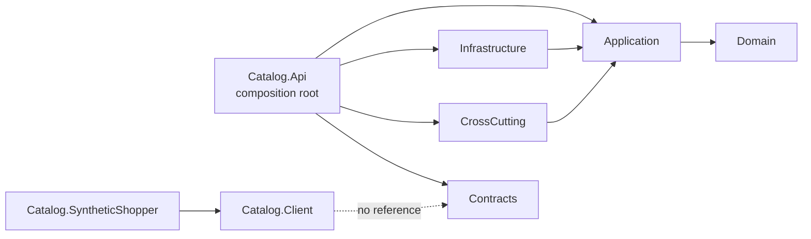
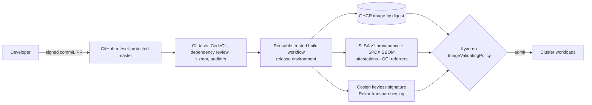
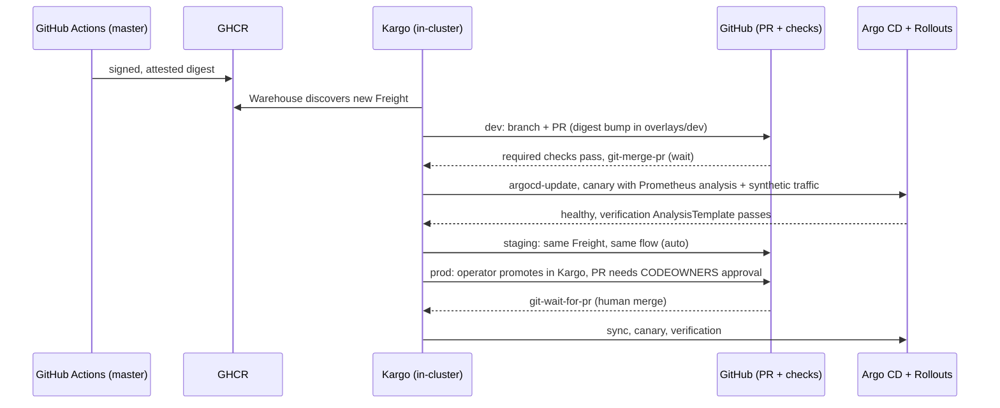

# Secure Product Catalog Platform: implementation plan

| Field | Value |
| --- | --- |
| Version | 2.0.1 |
| Date | 2026-10-04 |
| Status | Approved by the project owner on 2026-10-04. This file is the plan of record. Amend it by pull request and add a revision entry (section 19). |
| Phase plans | One file per phase, listed in section 14 |
| Evidence | Dated research records in [docs/research](../research/README.md) |
| Progress | [Status page](../project/STATUS.md) |

## 1. Review summary (v1 → v2)

The review kept every v1 outcome and the original premise. It checked time-sensitive assumptions against primary sources on 2026-10-04 and fixed the facts and design gaps that would have blocked delivery.

### 1.1 Verified facts that forced changes

| # | Verified finding | v1 assumption | v2 resolution |
| --- | --- | --- | --- |
| F1 | A private repo on GitHub Free cannot use rulesets or branch protection, environments, CODEOWNERS enforcement, code scanning, secret scanning, dependency review, Pages, or auto-merge. Artifact attestations for private repos require GitHub Enterprise Cloud. Private runners have 2 vCPU and 8 GB RAM, with 2,000 minutes per month. Rulesets already return HTTP 403 for this repo. | These controls would be available while the repo was private | The repo becomes public after Phase 0, marked as work in progress (user-approved). The polished v1.0 launch stays at the end. |
| F2 | CodeQL's terms allow analysis only of a released, OSI-licensed codebase and name private GitHub repos as excluded. | CodeQL could run while the repo was private | CodeQL runs only on the public repo. Private copies skip CodeQL with an explicit notice. |
| F3 | OpenBao 2.7.1 has no SQL Server database plugin. Its built-in plugins cover Cassandra, InfluxDB, MySQL, PostgreSQL, and Valkey, and its first-party external plugins add only MongoDB. | Dynamic SQL credentials from OpenBao | Switch to HashiCorp Vault Community Edition 2.x, which has a native MSSQL engine and whose BSL 1.1 license allows free use that doesn't compete with HashiCorp (user-approved). |
| F4 | `kubernetes/ingress-nginx` is retired and archived; maintenance ended in March 2026. | ingress-nginx | Gateway API with Envoy Gateway. |
| F5 | tfsec is frozen (its repo says it is "now part of Trivy"), and tfsec-action has had no release since January 2023. | A tfsec GitHub Action | Trivy's IaC misconfiguration scanning (`trivy config`), the scanner that Aqua's migration guide points to, mapped to the brief (user-approved). WP3.1 verifies how tfsec rule IDs map to Trivy's by running both scanners over a fixture. |
| F6 | The `trivy-action` and `setup-trivy` tags were hijacked in March 2026 (CVE-2026-33634). Versions from v0.35.0 and v0.2.6 on are safe. GitHub now offers SHA-pinning enforcement and immutable releases. | Pinning by convention only | Pinning is enforced by repo policy, zizmor, and the auditor. Trivy is pinned to verified versions, and the incident becomes a case study. |
| F7 | GitHub-hosted runners cannot reach a laptop-local cluster, and PRs created with `GITHUB_TOKEN` do not trigger workflows. | Promotion driven by GitHub Actions, with environment approval | In-cluster promotion with Kargo, using a least-privilege GitHub App (user-approved). |
| F8 | HybridCache has no cross-node L1 invalidation; dotnet/extensions#5517 is still open and targets .NET 11. | A custom cache modeled on HybridCache | FusionCache with an IMemoryCache L1, an IDistributedCache L2 on Valkey, and a Valkey backplane, behind an application port. |
| F9 | The Keycloak Operator's `KeycloakRealmImport` runs once and never updates a realm. | Realm-as-code via import | Single-source realm files: Compose and tests import them, and `keycloak-config-cli` reconciles them in the cluster. |
| F10 | Bitnami's free images and charts have been frozen since August–September 2025. | Chart sources unspecified | No Bitnami artifacts; use official charts and operators, or manifests kept in this repo. |
| F11 | SQL Server containers are x86-64 only, and Microsoft does not support running them under Rosetta, Prism, or QEMU emulation. | All hosts treated alike | An explicit host support matrix, with Codespaces or an x86-64 machine as the fallback. |
| F12 | kind v0.33.0 defaults to Kubernetes 1.37, but Envoy Gateway 1.9 supports only 1.33–1.36. | No version compatibility matrix | Pin the node image to the newest Kubernetes minor version that every component supports. |
| F13 | The repository's original initial commit and the local Git configuration used a personal email address. | Not considered | A repository-local GitHub noreply identity, and a one-time re-creation of the empty initial commit before publication (done in WP0.1 after the owner confirmed it). GitHub can keep the replaced commit retrievable by its ID for a time; see [ADR-0006](../adr/0006-commit-identity-and-privacy.md). |
| F14 | PactNet 5.0.1 has had no release for 19 months, and provider verification needs a real network socket. .NET 10 adds `WebApplicationFactory.UseKestrel()`. | In-process provider verification | Verify against a Kestrel-hosted provider, with an early spike to reduce risk. |
| F15 | FluentAssertions 8+, MediatR 13+, AutoMapper 15+, and MassTransit 9+ moved to commercial licenses. | No license policy | An enforced license allowlist, using nuget-license and dependency review. |
| F16 | coverlet does not work with Microsoft.Testing.Platform (MTP) v2, and the OpenTelemetry EF Core and StackExchange.Redis instrumentations are still beta. | Unspecified | MTP with Microsoft Code Coverage; beta instrumentations pinned and labeled as beta. |
| F17 | Codespaces on Free gives 120 core-hours per month, and SQL Server needs at least 2 GB of RAM. | Codespaces as the primary environment | Resource profiles with a documented quota; native Docker is the primary host for the full profile. |

### 1.2 Design gaps closed

| # | Gap in v1 | v2 resolution |
| --- | --- | --- |
| G1 | The plan existed only in this machine's session state | A docs-only Phase 0 publishes the plan, status, decisions, research, and agent instructions (user-approved). |
| G2 | One PR per phase would be too large to review | Phase integration branches, with work-package PRs merged into them (user-approved). |
| G3 | Phase 1 used "generated v1 contracts" that only became authoritative in Phase 4 | Design the contract first, in Phase 1. Phase 4 adds the governance: compatibility checks, Pact, and the client. |
| G4 | Canary analysis would run against a cluster with no traffic | A synthetic consumer workload plus k6 generate traffic, and analysis requires a minimum sample size. |
| G5 | Rollback ignored schema compatibility | An expand/contract migration policy, detection of destructive migrations, and an N-1 schema compatibility job. |
| G6 | Kyverno signature rules would block unsigned third-party images and the cluster bootstrap | Signature checks only for first-party images, registry and digest rules for third-party ones, an Audit→Enforce rollout, and a break-glass procedure. |
| G7 | No resource budget | `api`, `lite`, `full`, and `ci` profiles with measured budgets. |
| G8 | Requirements traceability had no mechanism | Requirement IDs, test traits, and a generated traceability report. |
| G9 | No numeric quality gates | Thresholds for coverage, mutation score, latency, and documentation. |
| G10 | ADRs appeared only in Phase 4 | Write ADRs when each decision is made; Phase 0 records evidence-backed Proposed ADRs. |
| G11 | Terraform and Argo CD both claimed `/k8s/policies` | An ownership matrix; policies move to `/policies`. |
| G12 | Platform controllers had no way to read secrets from the store | Vault Secrets Operator for the controllers, and a Vault Agent native sidecar for the API. |
| G13 | Keycloak's issuer would differ inside and outside the cluster | A single external issuer, with an in-cluster DNS rewrite. |
| G14 | Health checks could cause restart storms | Defined semantics for liveness, readiness, and startup probes. |
| G15 | Documented commands could drift from reality | Tutorials pull their commands in from tested scripts. |
| G16 | No agent instructions for portable AI-assisted work | `AGENTS.md`, Copilot instructions, path-specific instructions, `REVIEW.md`, and a session-handoff skill. |
| G17 | CRLF line endings and cross-platform scripting | `.gitattributes`, PowerShell 7 as a local .NET tool, and Pester tests. |
| G18 | Docker Hub rate limits and slow cluster recreation | Local pull-through registry caches. |
| G19 | The Terraform plan comment needed access to the local cluster | A fork-safe ephemeral-baseline plan on GitHub-hosted runners, plus an optional live plan run by the operator. |
| G20 | The GitHub OIDC → secret store trust couldn't be tested from hosted runners | CI proves the Vault JWT trust policy inside an ephemeral cluster. |
| G21 | Pact had no real consumer | A Kiota-generated `Catalog.Client`, used by a deployed `Catalog.SyntheticShopper` workload. |
| G22 | No visible signal of supply-chain posture | OpenSSF Scorecard, immutable releases, and a release evidence bundle. |

## 2. Mission and invariants

Build a production-oriented product catalog platform from an empty repository using .NET 10, Clean Architecture, zero-trust identity, shift-left supply-chain controls, Terraform-managed local Kubernetes infrastructure, and Argo CD GitOps delivery.

The repository has three equal purposes:

1. Provide a deliberate learning path for its author.
2. Teach intermediate and advanced developers how the architecture and tooling work.
3. Become a public engineering portfolio that demonstrates production judgment to recruiters and companies.

Readers are expected to understand the syntax of C#, YAML, HCL, PowerShell, and shell commands. They are not expected to know the tools, architectural patterns, security model, or delivery practices. Documentation, test plans, learning labs, decision records, and progress evidence are deliverables of each phase, not end-of-project cleanup.

### 2.1 Brief traceability (outcomes that must not change)

Every requirement from the original brief, the documentation request, and the planning request maps to a delivery point and verifiable evidence. Removing a row requires explicit user approval.

| Original requirement | Delivered in | Evidence |
| --- | --- | --- |
| Modular .NET Web API using Clean Architecture; strict interface segregation; DI everywhere | WP1.1, WP1.6–1.10 | Architecture tests; project graph doc; composition-root review |
| Domain layer (entities, value objects, domain events) | WP1.6 | Domain unit and property tests |
| Application layer (CQRS, validators, policies, event handlers) | WP1.7 | Application tests; decorator pipeline doc |
| Infrastructure (EF Core, repository, Unit of Work, migrations) | WP1.8 | Testcontainers integration and migration tests |
| Multi-level caching (IMemoryCache + distributed cache abstraction); caching service implementation | WP1.9 | Cross-replica invalidation and degradation tests |
| Cross-cutting concerns (logging, metrics, tracing) | WP1.11 | Telemetry assertion tests |
| Policy-based authorization | WP1.7, WP1.10 | Claims-to-policy and denied-path tests |
| Example endpoint using CQRS, caching, and domain events | WP1.10, Labs 1-3 | End-to-end integration test and lab |
| Multi-stage Dockerfile with a minimal production footprint | WP2.1 | Image tests; size budget |
| `ci.yml` triggered on PRs to the default branch (`master`) | WP1.1 (initial), WP2.2 | Workflow runs |
| `dotnet test` with Testcontainers | WP1.8, WP2.2 | CI test reports |
| CodeQL static analysis | WP2.3 | Code scanning results; ruleset gate |
| Trivy image scan; fail on critical vulnerabilities | WP2.4 | Failing-gate demonstration; SARIF |
| SBOM generation (Syft) | WP2.4 | SPDX and CycloneDX artifacts and attestations |
| SLSA provenance and Sigstore signing | WP2.5 | `gh attestation verify` and `cosign verify` output |
| Terraform: Kubernetes hosting environment | WP3.1, 3.2, 3.8 | Clean apply; smoke tests |
| MS SQL in a private tier with no public exposure | WP3.4, WP3.6 | Network probes; Kyverno denial tests |
| Network segmentation: public → private → data | WP3.2 | Chainsaw probe matrix |
| Workload identity (GitHub OIDC → secret broker; Kubernetes service account → secret broker) | WP3.3 | CI OIDC login test (positive and negative); Kubernetes auth tests |
| Least-privilege IAM roles | WP3.2–3.5 | Vault policy, RBAC, and SQL role tests |
| Secret-store integration; no secrets in GitHub Actions | WP3.3; WP1.2 auditor rule | Auditor evidence: no `secrets.*` beyond the platform token |
| OPA Gatekeeper or Kyverno runtime policies | WP3.6 | `kyverno test` and admission tests |
| GitHub Action that runs tfsec | WP3.9 via tfsec's official successor, Trivy IaC (user-approved) | SARIF; mapping ADR |
| GitHub Action that posts the Terraform plan diff as a formatted PR comment | WP3.9 | Sticky PR comment |
| Argo CD Application manifest pointing to `/k8s` | WP4.3 | Argo CD sync status |
| Versioned API contract definitions | WP1.5 (v1 authored); WP4.1 (governance) | oasdiff conformance and breaking-change gates |
| Pact consumer-driven contract tests for the primary endpoints | WP4.2 | Pact files; provider verification |
| GitOps promotion pipeline (dev → staging → prod) | WP4.5 | Kargo Freight history; promotion PRs |
| Rollback strategy (automated and manual) | WP4.4, WP4.6 | Drill evidence |
| README with Mermaid architecture, Clean Architecture boundaries, and a diagram linking the API, MS SQL, CI, and GitOps | WP0.3 (seed), WP4.7 | Rendered README and docs site |
| ADRs: OIDC choice; shift-left tools; GitOps vs. traditional CI/CD; domain events vs. direct orchestration | WP0.4 (Proposed); accepted in WP1.8 (domain events), WP2.5 (shift-left), WP3.3 (OIDC), WP4.3 (GitOps) | `docs/adr/` |
| All PRs run `/advanced-security-auditor` and `/blast-radius-evaluator`, with integration stubs | WP1.2 (core), WP1.12 (depth) | Required status checks |
| Every tool documented with an overview, decision rationale, setup tutorial, and external sources | All phases; enforced from WP1.3 | Documentation.Auditor report |
| Plan, phase plans, status, and progress in the repo; seamless continuation on another machine | Phase 0; WP1.2 | Fresh-clone resume test |
| Heavy on documentation, test plans, and automated tests | §10, §11, every phase | Traceability report |
| Easy setup for intermediate and advanced coders | §12; WP1.4; WP3.0 | Onboarding CI; profile measurements |
| Useful AI skills | §13; WP0.5; WP1.12 | Skill fixtures; governance record |
| Public GitHub repo that attracts recruiters | Phase 0 exit (public, WIP); v1.0 launch gate | Public repo; docs site; signed release |

## 3. Decision register

Status values: **Kept** (v1 decision unchanged), **Changed** (replaced in v2), and **New** (added in v2). Every decision gets an ADR. Process decisions are accepted in Phase 0. Technology decisions start as Proposed, carrying their research evidence, and are accepted when their work package validates them.

| Area | Decision | Status | Rationale |
| --- | --- | --- | --- |
| Business domain and API scope | Product catalog: products and categories; create, get, list, update, discontinue; no hard deletes | Kept | User choice |
| Runtime | .NET 10 LTS (EOL 2028-11-14), SDK `10.0.401`, `rollForward: latestPatch` | Kept (pin refreshed) | Verified current band |
| Deployment target | Cloud-agnostic local Kubernetes on kind | Kept | User choice |
| Environment topology | dev, staging, and prod namespaces in one cluster; overlays stay portable to separate clusters | Kept | User choice |
| API identity | Keycloak, realm-as-code | Kept | User choice |
| Realm-as-code mechanism | One source of realm files: imported by Compose and tests, reconciled in-cluster by `keycloak-config-cli`; Keycloak Operator for the runtime | New | F9 |
| Secret store and workload-identity broker | HashiCorp Vault Community Edition: Kubernetes auth, JWT auth for GitHub OIDC, MSSQL database engine | Changed (from OpenBao) | F3, user-approved |
| Secret delivery | Vault Agent as an explicit native sidecar for the API and the migration job; Vault Secrets Operator for platform controllers | New | G12 |
| Distributed cache | Valkey (LTS line, Redis protocol) | Kept | User choice |
| Cache implementation | FusionCache: IMemoryCache L1, IDistributedCache/Valkey L2, Valkey backplane, behind `ICatalogCache` | New | F8 |
| Runtime policy | Kyverno, using CEL-based `ValidatingPolicy` and `ImageValidatingPolicy` | Kept (API refreshed) | Stable in 1.19 |
| Ingress | Gateway API with Envoy Gateway; host exposure via kind port mappings on high ports | Changed (from ingress-nginx) | F4 |
| CNI and NetworkPolicy | kindnet with native NetworkPolicy enforcement, verified by probes; Cilium documented as the FQDN-egress alternative | New | Lighter footprint; portable API |
| Repository visibility | Public, marked work in progress, after Phase 0; polished v1.0 launch at the end | Changed | F1, F2, user-approved |
| Argo CD repository access | Anonymous read of the public repository | Changed (from a read-only GitHub App) | Follows the visibility decision |
| Git write automation | `catalog-promoter` GitHub App (contents and pull-requests write, single repo); key held in Vault and synced only to Kargo | New | F7, least privilege |
| Promotion engine | Kargo in-cluster: auto-merge for dev and staging after checks and verification; human-merged PR for prod | Changed (from Actions plus environments) | F7, user-approved |
| IaC scanning | Trivy IaC misconfiguration scanning as tfsec's official successor | Changed | F5, user-approved |
| Image distribution | Public GHCR package, signed and attested | Kept | User choice |
| Image signing and provenance | GitHub artifact attestations (SLSA v1, built by a reusable trusted workflow, Build L3) plus a keyless Cosign signature, both stored as OCI referrers | Refined | F1, F2 |
| Contract approach | Design-first OpenAPI 3.1 (YAML) authored in Phase 1; hand-written versioned DTOs with automated conformance checks; Kiota-generated consumer client | Changed | G3; NSwag lacks 3.1 support |
| Branch protocol | Docs-only Phase 0; phase integration branches with work-package PRs; phase PR merged to `master` | Changed | G1, G2, user-approved |
| Default branch | `master` | Kept | User choice |
| Commit identity | Repo-local GitHub noreply address; empty root commit rewritten before publication | New | F13, user-approved |
| PR auditing | Deterministic .NET auditor CLIs plus thin Copilot skill wrappers; required checks from WP1.2 on | Kept (timing tightened) | Brief |
| Documentation platform | DocFX (modern template), Diataxis, tool inventory with tiers; GitHub Pages from Phase 1 exit, WIP-labeled | Kept (timing refined) | Public repo makes Pages free |
| Progress tracking | `status.yaml`, the source of truth, generates `STATUS.md`; GitHub Issues and Milestones are synced from it | Kept | User choice |
| Portable development | Dev Container/Codespaces plus documented native setup; PowerShell 7 as a local .NET tool | Kept (refined) | G17 |
| Resource profiles | `api` (Compose), `lite`, `full`, `ci` | New | G7, F17 |
| SQL Server version | SQL Server 2022 (latest CU, digest-pinned); ADR on the path to 2025 | New | Maturity |
| Keycloak database | Dedicated database and login on the shared SQL Server instance, using a Vault static role | New | Footprint; ADR records the blast-radius tradeoff |
| Observability backends | OTel Collector, Prometheus, and Grafana everywhere; Tempo (monolithic) and Loki (single binary) in `full`; `grafana/otel-lgtm` for Compose only | New | F16; laptop budget |
| Test stack | xUnit v3 on MTP, Microsoft Code Coverage, ArchUnitNET, Verify, CsCheck, AwesomeAssertions, NSubstitute, Testcontainers, Stryker.NET, Schemathesis, PactNet, k6, Chainsaw, kyverno CLI, `terraform test`, Pester | New | Verified versions and licenses |
| Dependency license policy | Linked dependencies must use OSI-approved permissive or weak-copyleft licenses. Forbidden: FluentAssertions 8+, MediatR 13+, AutoMapper 15+, MassTransit 9+, and non-OSI licenses. Tools used but not redistributed (Vault BSL, k6 AGPL, Microsoft Code Coverage) need an ADR. | New | F15 |
| Dependency updates | Dependabot for every supported ecosystem; a scheduled freshness report files Issues for pins Dependabot cannot update; Renovate evaluated and deferred to avoid granting a third-party app write access | New | Zero trust |
| Platform UI authentication | Vault, Grafana, Argo CD, and Kargo sign in through Keycloak SSO; local admin accounts disabled after bootstrap | New | Zero trust |
| License | Apache-2.0 | Kept | User choice |
| External AI skills | Review first; installation only after separate approval, pinned to a commit | Kept | User choice |

## 4. Verified constraints (as of 2026-10-04)

### 4.1 GitHub capabilities by visibility (personal account, Free plan)

| Capability | Private (today) | Public (after Phase 0) | How the plan uses it |
| --- | --- | --- | --- |
| Rulesets and branch protection; CODEOWNERS enforcement | ✗ (HTTP 403 today) | ✓ | Required checks; owner review for sensitive paths |
| Environments, deployment branch policies, required reviewers | ✗ | ✓ | `publish` (only `master`) guards image signing and publishing; `release` (only `v*` tags; required reviewer) guards version releases |
| CodeQL analysis | ✗ (license) | ✓ | WP2.3 |
| Secret scanning, push protection, private vulnerability reporting | ✗ | ✓ | Enabled at Phase 0 exit |
| Dependency review action | ✗ | ✓ | WP2.3 |
| Artifact attestations | ✗ (Enterprise Cloud only) | ✓ (public Sigstore) | WP2.5 |
| GitHub Pages | ✗ | ✓ | From Phase 1 exit |
| Auto-merge | ✗ | ✓ | Dependabot and promotion PRs |
| Merge queue | ✗ | ✗ (organization-owned repos only) | Not used |
| Hosted runners | 2 vCPU / 8 GB; 2,000 min/month | 4 vCPU / 16 GB; standard runners free | Ephemeral-cluster CI jobs |

Capability-aware workflows detect repository visibility. Where a feature or license is unavailable, for example on a learner's private copy, the job prints `SKIPPED: <capability> unavailable` and records the skip in evidence; it never reports a silent pass. CodeQL never runs on a private copy.

### 4.2 Connectivity model

- GitHub-hosted runners reach GitHub, GHCR, Sigstore, and package registries. They have no inbound path to a developer's local cluster.
- The local cluster makes outbound calls only: Argo CD reads the public repository, Kargo watches GHCR and calls the GitHub API with the promoter App, Kyverno fetches Sigstore trust material, and Vault fetches GitHub's OIDC JWKS.
- Therefore: build, test, scan, sign, and publish happen in GitHub Actions. Deploy, verify, promote, and roll back happen in the cluster. CI validates infrastructure changes in ephemeral kind clusters it creates itself.
- Self-hosted runners are not part of the default design. GitHub warns against them on public repositories, and the self-hosted pricing change it announced has been postponed, not cancelled. The live Terraform plan is an operator-run script.

### 4.3 Host support matrix

| Host | API-only path (Compose) | Full platform (kind) |
| --- | --- | --- |
| Linux x86-64 (Docker Engine) | Supported | Supported |
| Windows 11 x86-64 (Docker Desktop, WSL2) | Supported | Supported |
| macOS Intel (Docker Desktop) | Supported | Supported, subject to resources |
| macOS Apple Silicon | Best-effort: SQL Server runs under Rosetta, which Microsoft does not support | Not supported; use Codespaces or a remote x86-64 host |
| Windows on Arm | Best-effort | Not supported |
| GitHub Codespaces | Supported (4-core) | `lite` on 4-core, `full` on 8-core; quota documented |

### 4.4 Kubernetes version compatibility

The kind node image is pinned to the newest Kubernetes minor version supported by every platform component: Envoy Gateway, Kyverno, Argo CD, Argo Rollouts, Kargo, cert-manager, Vault Secrets Operator, and the Keycloak Operator. WP3.0 produces `docs/reference/compatibility-matrix.md`, and a scheduled job flags drift. At review time, Envoy Gateway 1.9 caps the cluster at Kubernetes 1.36.

### 4.5 Research records

The evidence behind these decisions is published in [docs/research](../research/README.md) and cited by the ADRs:

- [GitHub and supply-chain verification](../research/2026-10-04-github-supply-chain-verification.md) (agent-produced, verbatim)
- [Kubernetes platform verification](../research/2026-10-04-kubernetes-platform-verification.md) (agent-produced, verbatim)
- [.NET ecosystem verification](../research/2026-10-04-dotnet-ecosystem-verification.md) (agent-produced, verbatim)
- [Decision-critical addendum](../research/2026-10-04-decision-critical-addendum.md): facts checked first-hand, and corrections to the records above
- [External AI skill review](../research/2026-10-04-external-skill-review.md): security, license, and fit review of the candidate skills

## 5. Delivery model

### 5.1 Phases and branches

| Phase | Integration branch | Work-package branches | Merge to `master` | Release |
| --- | --- | --- | --- | --- |
| 0: Foundation and early publication | `phase/0-foundation` | None (single docs PR, plus one closeout PR that records publication results) | Merge commit | none |
| 1: API core and data layer | `phase/1-api-core` | `wp/1.NN-<slug>` | Merge commit | `v0.1.0` |
| 2: CI and shift-left security | `phase/2-secure-ci` | `wp/2.NN-<slug>` | Merge commit | `v0.2.0` (first signed and attested) |
| 3: Zero-trust platform | `phase/3-zero-trust-platform` | `wp/3.NN-<slug>` | Merge commit | `v0.3.0` |
| 4: Contracts, GitOps, and progressive delivery | `phase/4-contracts-gitops` | `wp/4.NN-<slug>` | Merge commit | `v0.4.0` |
| v1.0 launch | none (release only) | none | none | `v1.0.0` |

A phase branch is created from `master` only after the previous phase PR merges. Spike branches (`spike/<phase>.<x>-<slug>`) are never merged. Their findings are merged as spike reports and ADRs through the owning work package.

### 5.2 Pull-request flow

- **Work-package PR → phase branch:** squash-merged with a Conventional Commit title. Each PR covers one work package and must meet its Definition of Done.
- **Phase PR → `master`:** merged with a merge commit, so `git log --first-parent master` reads as phase history. Requires the phase exit gate and a phase retrospective.
- **Promotion PRs (Kargo bot) → `master`:** squash-merged. They change only image digests in `k8s/apps/*/overlays/<env>`.
- **Dependabot PRs** target `master`. `master` is merged into the active phase branch, via a PR, at least weekly and before the phase PR.
- **Hotfixes:** a `fix/<slug>` PR to `master`, then merged into the active phase branch.
- **CI triggers:** pull requests to `master` and `phase/**`; pushes to `master`; tags `v*`; schedules (nightly and weekly); `workflow_dispatch`. Images are published, signed, and attested only from `master` or tags, inside a reusable trusted workflow. That workflow runs behind the `publish` environment (deployment branch policy: `master` only), so dev promotion stays automatic, and behind the `release` environment (`v*` tags; required reviewer) for version releases.

### 5.3 Branch protection and solo-maintainer governance

The following applies once the repository is public:

- **`master` ruleset:** PR required; required status checks (governance, build-test, docs, plus the security and image checks once they exist); conversations resolved; no force pushes or deletions; CODEOWNERS review required for `.github/**`, `governance/**`, `policies/**`, `infra/**`, `k8s/apps/*/overlays/prod/**`, `contracts/**`, and `src/**/Migrations/**`; code scanning results required (from WP2.3).
- **`phase/**` ruleset:** PR required, required status checks, no force pushes.
- **Solo maintainer:** GitHub does not let authors approve their own PRs. The owner may bypass rules for pull requests only, and only when CODEOWNERS self-review is the only unmet rule. GitHub records the bypass. Bot-authored promotion PRs touching prod need a real owner approval.
- **Signed commits:** recommended for human commits (SSH signing). Not required by the ruleset, because Kargo's commits are bot commits.
- **Copilot code review:** advisory, guided by `REVIEW.md`. Findings are fixed or answered before merge.

### 5.4 Definition of Ready and Definition of Done

**Ready:** an Issue exists with the work-package ID, scope, non-goals, acceptance criteria, requirement IDs, planned test cases, documentation deliverables, size, and completed dependencies.

**Done:**

1. Required checks are green, with no new analyzer warnings.
2. Tests are added or updated and tagged with requirement IDs, and thresholds (§10.4) are met.
3. Documentation is updated: tool pages for new tools, tutorials and labs, and reference pages; documentation checks pass.
4. `status.yaml` and the generated `STATUS.md` are updated, including **Resume here**.
5. The `CHANGELOG.md` *Unreleased* section is updated.
6. An ADR is created or updated for every decision made.
7. The threat model is updated whenever a trust boundary, data flow, or credential changes.
8. The governance auditors pass, and the PR template checklist is complete.
9. The branch is pushed, so another machine can resume.

### 5.5 Risk spikes

Each phase begins with work package `x.0`: time-boxed spikes of one day or less each for the highest-uncertainty integrations. Each spike produces a report under `docs/research/spikes/` and an ADR update. A failed spike triggers a plan amendment before any dependent work package starts. Spikes are scheduled in the phase before the risk would otherwise land late. For example, PactNet on .NET 10 is spiked in Phase 1, not Phase 4.

### 5.6 Versioning and releases

- Semantic versioning, with `v0.x` releases during the phases.
- Conventional Commits, with PR titles validated in CI.
- Release notes generated by git-cliff.
- From `v0.2.0` on, every release carries signed, attested images and a release evidence bundle: test reports, coverage, SBOMs, scan results, verification transcripts, and a docs snapshot.
- Immutable releases are enabled from the first tag.

### 5.7 Sizing

| Size | Focused effort |
| --- | --- |
| S | ≤ 1 day |
| M | 2–4 days |
| L | 5–8 days |

A work package estimated above L must be split. Sizes guide sequencing only; the plan sets no calendar dates.

## 6. Portable planning, progress, and handoff

| Artifact | Purpose |
| --- | --- |
| `docs/plans/implementation-plan.md` | This plan, with revision history |
| `docs/plans/phases/phase-N-<name>.md` | One plan per phase: goals, learning outcomes, scope and non-goals, work packages, tests, docs, risks, exit gate |
| `docs/project/status.yaml` and `status.schema.json` | Source of truth: phase and work-package state (`planned`, `in_progress`, `blocked`, `completed`); branch, PR, Issue, and Milestone; dependencies; blockers; evidence links; release |
| `docs/project/STATUS.md` | Generated status page. Its **Resume here** section names the active branch and work package, the last completed step, the next action, open PRs, and local-environment notes |
| `docs/project/risk-register.md` | Living risk register (§16) |
| `docs/requirements/requirements.yaml` | Requirement IDs, source (brief or user), and the work packages that deliver each one |
| `docs/testing/traceability.md` | Generated map of requirements → tests → evidence |
| `docs/research/` | Dated verification records and spike reports |
| `docs/journal/phase-N-retrospective.md` | What was built, what was learned, and what changed |

**Resume protocol** (codified in `AGENTS.md` and the `session-handoff` skill):

1. Clone or pull, then open the Dev Container.
2. Read `STATUS.md` → **Resume here**.
3. Check out the active branch.
4. Run `dev doctor`.
5. Continue with the next action.

**End-of-session protocol:**

1. Update `status.yaml`.
2. Regenerate `STATUS.md`.
3. Commit and push.
4. Keep the draft PR current.

**Rules that keep work portable:**

- **Local environments are disposable.** Clusters, Terraform state for the kind stack, Vault unseal keys, and generated local passwords exist only for one machine's environment. On a new machine they are regenerated, never migrated, and the machine-migration runbook explains how.
- **GitHub sync:** a governance command syncs Issues, Milestones, and labels from `status.yaml`, using stable IDs embedded in each Issue body. Phase 0 creates the initial set with recorded `gh` commands. Phase 1 adds the sync command, which adopts those Issues.
- **Never mirror-push.** Local Copilot checkpoint refs (`refs/copilot/**`) are never pushed, so `git push --mirror` is forbidden.

## 7. Target repository structure

```text
.
|-- .config/dotnet-tools.json          # local tools: PowerShell, DocFX, nuget-license, dotnet-stryker, git-cliff wrapper
|-- .devcontainer/                     # devcontainer.json, Dockerfile, devcontainer-lock.json
|-- .github/
|   |-- CODEOWNERS
|   |-- ISSUE_TEMPLATE/                # bug, work package, spike, docs, question (issue forms)
|   |-- PULL_REQUEST_TEMPLATE.md       # Definition of Done checklist
|   |-- copilot-instructions.md
|   |-- dependabot.yml
|   |-- instructions/                  # csharp, tests, docs, workflows, terraform, kubernetes, policies (*.instructions.md)
|   |-- skills/                        # advanced-security-auditor, blast-radius-evaluator, documentation-auditor,
|   |                                  # test-plan-evaluator, adr-assistant, tool-doc-author, session-handoff
|   `-- workflows/                     # governance, ci, docs, terraform, terraform-plan-comment, scorecard,
|                                      # nightly, release, plus reusable _build-test, _trusted-image, _scan, _verify
|-- contracts/
|   `-- openapi/catalog/v1/catalog.openapi.yaml
|-- docs/
|   |-- index.md, toc.yml, glossary.md
|   |-- adr/                           # NNNN-title.md, index generated
|   |-- explanation/                   # concepts: Clean Architecture, outbox, caching consistency, zero trust, SLSA, GitOps
|   |-- governance/                    # github-settings.md, ai-skills.md, dependency-policy.md, contribution-policy.md
|   |-- journal/                       # phase retrospectives
|   |-- labs/                          # hands-on labs per phase
|   |-- plans/implementation-plan.md and plans/phases/
|   |-- portfolio/                     # walkthrough, demo script, evidence index
|   |-- project/                       # status.yaml, status.schema.json, STATUS.md, risk-register.md
|   |-- reference/                     # tools/ (+ inventory.yaml), api/, error-catalog.md, compatibility-matrix.md, configuration.md
|   |-- requirements/                  # requirements.yaml, brief-traceability.md
|   |-- research/                      # dated verification records, spikes/
|   |-- runbooks/
|   |-- security/                      # threat-model.md, controls-matrix.md, trust-anchors.md, incident case studies
|   |-- testing/                       # strategy.md, plans/phase-N.md, traceability.md
|   `-- tutorials/                     # 00-start-here, quick start, profiles, how-to guides
|-- governance/
|   |-- policies/                      # security-policy.yaml, blast-radius-map.yaml, license-policy.json, forbidden-packages.json
|   `-- github/                        # repository settings, rulesets, labels, GitHub App manifests (permissions as code)
|-- identity/keycloak/realms/          # catalog-realm.json, platform-realm.json (single source; ${ENV} placeholders)
|-- infra/terraform/
|   |-- modules/                       # kind-cluster, namespaces, network-policies, gateway, pki, vault, vault-config,
|   |                                  # data-sqlserver, data-valkey, keycloak, kyverno, observability, gitops
|   |-- stacks/                        # kind, platform, security, gitops (separate state each)
|   `-- profiles/                      # lite.tfvars, full.tfvars, ci.tfvars
|-- k8s/                               # Argo CD-owned desired state ("/k8s" in the brief)
|   |-- bootstrap/                     # root Application, AppProjects, ApplicationSet
|   |-- apps/catalog/                  # base, components (analysis, vault-agent, network), overlays/dev|staging|prod
|   |-- apps/synthetic-shopper/        # base, overlays
|   `-- promotion/                     # Kargo Project, Warehouse, Stages, PromotionTasks
|-- policies/kyverno/                  # policies, exceptions, tests (applied by Terraform; never synced by Argo CD)
|-- scripts/                           # PowerShell 7 entry point `dev.ps1` + modules + Pester tests; thin `dev` shims
|-- src/
|   |-- Catalog.Domain/
|   |-- Catalog.Application/
|   |-- Catalog.Contracts/             # versioned transport records (V1 namespace)
|   |-- Catalog.Infrastructure/
|   |-- Catalog.CrossCutting/
|   |-- Catalog.Api/                   # composition root
|   |-- Catalog.Client/                # Kiota-generated client + facade (consumer side; no server references)
|   `-- Catalog.SyntheticShopper/      # consumer workload generating realistic traffic
|-- tests/
|   |-- Catalog.Domain.Tests/, Catalog.Application.Tests/, Catalog.Architecture.Tests/
|   |-- Catalog.Infrastructure.IntegrationTests/, Catalog.Api.IntegrationTests/, Catalog.Identity.ContractTests/
|   |-- Catalog.Image.Tests/, Catalog.Client.PactTests/ (consumer), Catalog.Api.PactVerification/ (provider)
|   |-- Governance.Auditor.Tests/, Documentation.Auditor.Tests/
|   |-- api-fuzz/ (Schemathesis config), k6/, chainsaw/
|-- tools/
|   |-- Governance.Auditor/            # security, blast-radius, status, trace, github-sync, test-summary, freshness
|   |-- Documentation.Auditor/         # inventory, structure, includes, front matter, freshness
|   `-- versions.yaml                  # single tool-version manifest (CLI tools, images, charts, devcontainer)
|-- AGENTS.md, REVIEW.md, README.md, LICENSE, NOTICE, CHANGELOG.md, CONTRIBUTING.md, CODE_OF_CONDUCT.md
|-- SECURITY.md, SUPPORT.md, GOVERNANCE.md, cliff.toml, docfx.json, compose.yaml, .env.example
|-- Directory.Build.props, Directory.Packages.props, NuGet.config, global.json, ProductCatalog.slnx
|-- Dockerfile, .dockerignore, .editorconfig, .gitattributes, .gitignore
```

**Ownership rule:**

- **Terraform** owns cluster-scoped and shared resources, platform services, and `policies/`.
- **Argo CD** owns everything under `k8s/`.
- **Kargo** only writes image digests to Git, through promotion PRs.

## 8. Architecture specification

### 8.1 Layers and dependency rules



**Dependency rules:**

| Project | May reference | Must not reference or contain |
| --- | --- | --- |
| `Domain` | BCL only | EF Core, ASP.NET Core, serializers, logging frameworks |
| `Application` | `Domain` | Infrastructure types. It defines the ports: repositories, `IUnitOfWork`, `ICatalogCache`, `IIdGenerator`, `ICurrentPrincipal`, outbox dispatcher, telemetry. It takes `TimeProvider` from the BCL. |
| `Contracts` | Nothing | Domain types |
| `Infrastructure` | `Application` | It implements persistence, outbox, idempotency, credential sources, and Valkey connectivity |
| `CrossCutting` | `Application` | `Infrastructure`. It implements handler decorators (telemetry, validation, authorization, idempotency, transaction, query caching), observability, and the FusionCache adapter over the abstract `IDistributedCache` and backplane registered by `Infrastructure`. |
| `Api` | Everything (composition root) | Business logic. It maps contracts to commands and queries and owns all DI registration. |
| `Catalog.Client` | Code generated from the authored contract only | Server projects; the consumer stays independent |

**Rules enforced by ArchUnitNET tests:**

- The dependency rules above.
- No service locator: `IServiceProvider` is injected only in the composition root.
- No static mutable state.
- Handlers are `internal sealed`.
- Domain types never appear in contracts.
- Endpoints depend only on handler interfaces.

### 8.2 CQRS pipeline

- **Handler interfaces:** `ICommandHandler<TCommand, TResult>` and `IQueryHandler<TQuery, TResult>`. Endpoints inject the specific handler interface directly; there is no mediator and no runtime dispatch by type lookup.
- **Decorator order, outermost first:**
  - Commands: telemetry and logging → validation → authorization → idempotency (commands with an idempotency key) → transaction/UoW → handler.
  - Queries: telemetry → validation → authorization → query caching (marked queries only) → handler.
  - Endpoint policies (authentication and scope) run before the pipeline. The order and its rationale are recorded in an ADR.
- **Registration:** explicit extension methods per feature. Decoration uses Scrutor (MIT) or hand-written registration; the ADR decides.
- **Results:** `Result<T>` with typed errors (`ValidationFailed`, `NotFound`, `Conflict`, `PreconditionFailed`, `PreconditionRequired`, `Forbidden`, `IdempotencyKeyReused`). A single mapping table translates errors to RFC 9457 Problem Details (§8.6).

### 8.3 Domain model

- **Aggregates:** `Product` and `Category`, with identifiers `ProductId` and `CategoryId`. IDs are UUIDv7, created by `IIdGenerator` (`Guid.CreateVersion7` by default) so tests are deterministic.
- **Value objects:**
  - `Sku`: normalized to upper case and pattern-validated.
  - `ProductName` and `CategoryName`: trimmed, with length bounds.
  - `Description`: bounded length.
  - `Money`: decimal amount ≥ 0, with an ISO 4217 currency from an allowed set and currency-specific precision.
- **Lifecycle:** `Active` → `Discontinued`. Discontinuing is idempotent at the HTTP level, and discontinued products reject price and category changes.
- **Invariants:**
  - A product's category must exist and be active when assigned.
  - Identity is immutable.
  - SKU uniqueness is guaranteed by a unique database index. The application pre-checks to return a friendly error; the domain cannot guarantee global uniqueness on its own.
- **Domain events:** `ProductCreated`, `ProductDetailsChanged`, `ProductPriceChanged`, `ProductCategoryChanged`, `ProductDiscontinued`, `CategoryCreated`, `CategoryRenamed`, `CategoryDiscontinued`. Each event is versioned (`schemaVersion`) and carries `occurredAt` from `TimeProvider`.

### 8.4 Persistence, Unit of Work, outbox, and idempotency

- **Schema `catalog`:** tables `Products`, `Categories`, `OutboxMessages`, `OutboxReceipts`, and `IdempotencyRecords`, plus EF migrations history in the same schema.
  - `rowversion` concurrency tokens.
  - A filtered unique index on the normalized SKU.
  - Keyset-pagination indexes: `(CreatedAt DESC, Id)` and `(Name, Id)`.
  - Explicit decimal precision.
- **Unit of Work:** `IUnitOfWork` wraps one `DbContext` transaction. A `SaveChangesInterceptor` converts recorded domain events into outbox rows inside the same transaction.
- **Outbox processor:** a `BackgroundService` delivers at least once.
  - It leases batches with `READPAST, UPDLOCK, ROWLOCK` semantics.
  - Retries use exponential backoff with jitter. After N attempts a message moves to a `dead-letter` state, which emits a metric and an alert.
  - Every handler is idempotent and records a receipt.
  - Ordering is guaranteed only within a single message.
- **Immediate dispatch:** after commit, the writing node publishes in-process for low latency, on a best-effort basis. The outbox guarantees eventual completion.
- **Idempotency:** the `Idempotency-Key` header follows the IETF httpapi draft. It is required on `POST` creates.
  - Each record stores the key, the caller (`sub`/`azp`), a request hash, the status, and a response snapshot, and expires after 24 hours.
  - The record is written in the same transaction as the command's effect.
  - Reusing a key with a different payload returns 422. Concurrent use of the same key returns 409.
  - A cleanup job purges expired records.
- **Concurrency:** `rowversion` is exposed as a strong `ETag`. `PUT` and `discontinue` require `If-Match`: a missing header returns 428, and a stale one returns 412. `GET` supports `If-None-Match`, returning 304.
- **Credentials:** an `IDbConnectionInterceptor` sets the connection string from a cached `ICredentialSource` on `ConnectionOpeningAsync`. Pooling stays enabled. On rotation, pools keyed by the old credential are cleared after a grace period, and the clearing is tested.
- **Migrations:** forward-only, with an expand/contract discipline (§8.10).
  - CI builds an EF migration bundle and generates an idempotent SQL script for review.
  - A one-shot Kubernetes job runs the bundle under the `catalog-migrator` identity. Application replicas never migrate.
- **Seed data:** delivered through the API (`dev seed`) for demos, never by migrations. The prod overlay is never seeded.

### 8.5 Caching and consistency model

- **Stack:** FusionCache.
  - **L1:** `IMemoryCache`, size-limited.
  - **L2:** `IDistributedCache` backed by Valkey through StackExchange.Redis.
  - **Backplane:** Valkey pub/sub, on a per-environment channel prefix.
  - Exposed to the application through `ICatalogCache`. Payloads use System.Text.Json source-generated contexts and versioned cache contracts.
- **Keys and tags:**
  - Product keys: `catalog:{env}:v{n}:product:{id}`, tagged `product:{id}`.
  - List keys: built from a normalized query hash, tagged `products:list` and `category:{id}`.
  - The ACL lets each environment user access only `~catalog:{env}:*` and `&catalog:{env}:*`.
- **Write path:**
  1. Commit.
  2. Remove the affected keys and tags synchronously on the writing node. L2 removal is awaited, and the backplane notifies other nodes' L1.
  3. The outbox handler repeats the invalidation to guarantee it.
  4. The response returns the new representation and its `ETag`.
- **Consistency guarantees:**
  - The writer reads its own writes.
  - Other readers see bounded staleness: at most the backplane latency while it is healthy, otherwise at most the L1 TTL (default 30 s; documented SLO).
  - List queries use a short TTL and tag invalidation.
- **Stampede protection:** FusionCache provides per-key single-flight within each node. Stampedes across nodes are bounded and documented; no distributed lock is used.
- **Failure modes:** if Valkey is unavailable, the cache falls back to L1 plus the database behind a circuit breaker. Readiness stays green and an alert fires. If the backplane is unavailable, staleness widens to the L1 TTL, a metric reports it, and an alert fires.
- **Proof:**
  - A two-host integration test against a shared Valkey Testcontainer proves cross-node invalidation.
  - A chaos test stops Valkey and proves graceful degradation.
  - The Phase 4 canary analysis checks cache hit ratio and staleness metrics.

### 8.6 API contract and HTTP semantics

- **Resources:**
  - `/api/v1/categories` and `/api/v1/categories/{id}`
  - `/api/v1/products` and `/api/v1/products/{id}`
  - Action endpoints: `POST .../{id}/discontinue`
  - Product list filters: `categoryId`, `status`, `q`, `sort` (`createdAt` or `name`), `pageSize` (≤100), `cursor`
- **Versioning:** a URL segment (`v1`) implemented with Asp.Versioning. Responses send `api-supported-versions`. The deprecation policy uses the `Deprecation` header (RFC 9745) and the `Sunset` header (RFC 8594), with a documented support window.
- **Conditional requests and idempotency:** as specified in §8.4.
- **Pagination:** opaque, versioned base64url cursors over keyset positions. Responses include `nextCursor` in the body and a `Link` header.
- **Errors:** RFC 9457 `application/problem+json`. `type` URIs resolve to `docs/reference/error-catalog.md`, which is published on the docs site. Every error includes a `traceId`, and validation errors list per-field messages.
- **Input handling:** strict JSON, so unknown properties return 400. Request bodies have size and depth limits. Rate limiting returns 429 with `Retry-After`.
- **Security in the contract:** OAuth 2.0 security schemes with the scopes `catalog.read`, `catalog.write`, and `catalog.admin`.
- **Contract workflow:**
  1. Author OpenAPI 3.1 in YAML.
  2. Lint it. The linter (Redocly CLI, Spectral, or vacuum) is chosen in the WP1.5 ADR.
  3. Write examples for every operation and error.
  4. Hand-write the DTOs in `Catalog.Contracts.V1`.
  5. Generate the served document at build time as JSON (`Microsoft.Extensions.ApiDescription.Server`).
  6. Run the conformance test: `oasdiff` must find structural equality between the authored and generated documents, ignoring descriptions, examples, and summaries.
  7. In Phase 4, run a breaking-change gate against the last released contract.
- **Viewers:** Scalar runs in the Development environment only. A static viewer embedded in the DocFX site renders the authored contract.

### 8.7 Identity and authorization

- **`catalog` realm:**
  - **Client scopes:** `catalog.read`, `catalog.write`, and `catalog.admin`. An audience mapper sets `aud=catalog-api`.
  - **Realm roles:** `catalog-reader`, `catalog-editor`, and `catalog-admin`, mapped to the scopes.
  - **Clients:**
    - `catalog-api`: the resource server.
    - `catalog-cli`: a public client using PKCE and the device flow, for humans and labs.
    - `synthetic-shopper` and `smoke-tests`: confidential clients using client credentials, with secrets held in Vault.
- **Permission matrix:**
  - `catalog.read`: all GETs.
  - `catalog.write`: create and update products.
  - `catalog.admin`: discontinue products, and all category writes.
  - The matrix is published as a table and tested exhaustively.
- **Token validation:**
  - Exact issuer and audience checks.
  - JWKS signature validation that tolerates key rotation.
  - Algorithm allowlist: RS256 and ES256.
  - Lifetime checks with ≤30 s clock skew.
  - Scopes are parsed from the space-delimited `scope` claim.
- **Issuer consistency:** Keycloak always advertises its external hostname, `https://id.catalog.localtest.me:8443/realms/<realm>`. Inside the cluster, CoreDNS rewrites that hostname to the gateway service, and the gateway presents a certificate chained to the trust-manager CA bundle. Compose uses one fixed `localhost` issuer.
- **Testing:**
  - API integration tests use an in-process test issuer that exercises the same validation pipeline.
  - `Catalog.Identity.ContractTests` imports the real realm file into a Keycloak Testcontainer and proves the claims-to-policy mapping.
- **`platform` realm:**
  - Human operators, in groups `platform-admins` and `platform-viewers`.
  - OIDC clients for Vault, Grafana, Argo CD, and Kargo.
  - Local admin accounts are disabled after bootstrap. Break-glass procedures are documented.
- **Single source:** the realm files live in `identity/keycloak/realms/` with `${ENV}` placeholders. Compose (`--import-realm`), Testcontainers (`WithRealm`), and `keycloak-config-cli` (in-cluster reconciliation) all consume them.

### 8.8 Configuration, secrets, and credential rotation

- **Configuration layering:** `appsettings.json` holds non-secret defaults, overridden by environment variables, then by mounted secret files. Options are validated with `ValidateOnStart`. Every setting is documented in `docs/reference/configuration.md`, which a test generates and checks for drift.
- **Compose (API-only path):** `dev bootstrap` generates random local passwords into an ignored `.env`. `.env.example` lists the variable names only.
- **API on Kubernetes:**
  - A Vault Agent native sidecar (an init container with `restartPolicy: Always`) authenticates with the pod's service-account JWT and renders `sql.json` and `valkey.json` to a memory-backed `emptyDir`.
  - `RotatingCredentialSource` watches those files and swaps the cached credential. New connections use the new credential, and pools keyed by the old one are cleared after a grace period.
  - Lease TTL is 1 h and max TTL 24 h. Vault's MSSQL revocation statements drop the login and kill its sessions, and a test proves the app reconnects.
  - Valkey users are dynamic only if WP3.0 proves Vault's Redis plugin works with Valkey ACLs; otherwise they use KV-held rotated credentials.
- **Migration job:** the same sidecar pattern, using the `catalog-migrator` role (DDL), with a short TTL. Native sidecars stop when the job completes.
- **Platform controllers** (Kargo, Keycloak, Grafana, keycloak-config-cli): Vault Secrets Operator uses namespace-scoped `VaultAuth` and syncs only the paths each controller needs into Kubernetes Secrets, restarting workloads where they are supported. etcd encryption at rest is enabled in kind.
- **GitHub Actions:** no repository or environment secrets at all. A blocking auditor rule allows only `GITHUB_TOKEN` and OIDC.
- **Trust anchors:** listed in `docs/security/trust-anchors.md` with custody, scope, rotation, and break-glass procedures for each:
  - The kind admin kubeconfig.
  - Vault unseal keys, held by the operator outside the repository.
  - The Vault root token, revoked after bootstrap and regenerated from unseal keys only when needed.
  - The SQL bootstrap principal: `sa` is disabled after creating `vault-db-admin`, whose password Vault then rotates with `rotate-root`.
  - GitHub App private keys, stored in Vault KV.
  - The Keycloak temporary admin, deleted after bootstrap.
  - The local root CA key.

### 8.9 Health model

| Endpoint | Semantics | Used by |
| --- | --- | --- |
| `/health/live` | The process is responsive. Checks no dependencies. | Liveness probe |
| `/health/startup` | Configuration and initial credentials are loaded. | Startup probe |
| `/health/ready` | SQL is reachable with current credentials, the schema version is at least the expected version, and credentials are fresh. Valkey is excluded because the app degrades gracefully without it. | Readiness probe; the gateway |

Health endpoints are served on a management port (8081) that the gateway never routes to. Detailed dependency status is available only on the management port, from inside the cluster. WP3.0 verifies that probes still reach the pod when NetworkPolicy is enforced.

### 8.10 Database migration policy

- **Expand/contract:** every release's schema must remain compatible with the previous release's application (N-1). Destructive changes (drops, renames, narrowing alters, new `NOT NULL` columns without defaults) take two releases:
  1. **Expand:** add the new schema, write to both old and new, and backfill.
  2. **Contract:** remove the old schema once N-1 no longer needs it.
- **Enforcement:** the blast-radius evaluator flags destructive operations in migration diffs. A flagged PR requires the `migration:contract-phase` label, an ADR or runbook entry, and CODEOWNERS review.
- **N-1 compatibility job (Phase 4):** applies the new migrations, starts the previous release's image from GHCR against them, and runs the smoke suite.
- **Rollback:** application rollback never rolls back the schema. Data recovery from backups is a last resort, covered by a runbook and rehearsed in Phase 3.

### 8.11 Observability and service-level objectives

- **Traces:**
  - Stable instrumentation: ASP.NET Core, HttpClient, and SqlClient.
  - Beta instrumentation, pinned and labeled: EF Core and StackExchange.Redis.
  - Also instrumented: FusionCache, and custom `ActivitySource`s for handlers, the outbox, and credential rotation.
  - The `traceId` is included in Problem Details responses.
- **Metrics:**
  - Built-in ASP.NET Core 10 and runtime metrics, including `http.server.request.duration` and the authentication and authorization counters.
  - Custom metrics: cache hit/miss/stale counts, outbox backlog, age, and failures, handler duration, credential rotations, and idempotency replays.
- **Logs:** structured JSON through the OpenTelemetry logs exporter. Data is redacted with `Microsoft.Extensions.Compliance.Redaction` classifications, so tokens, secrets, and personal data never appear.
- **Collector pipeline:**
  1. Receive OTLP.
  2. Process with `memory_limiter`, `k8sattributes`, attribute redaction, and `batch`.
  3. Export to Prometheus, Tempo, and Loki (the latter two in the `full` profile).
  - The configuration is checked with `otelcol validate`.
- **SLOs (teaching defaults, in `docs/explanation/slos.md`):**
  - Availability ≥ 99.5% (dev, staging) and ≥ 99.9% (prod) under synthetic load.
  - p95 latency: cached product GET ≤ 100 ms; writes ≤ 300 ms.
  - 5xx rate < 1%.
  - Cache hit ratio ≥ 80% for product details under read-heavy load.
  - Outbox age p95 < 5 s.
  - Rollout analysis and alerts use these SLOs.
- **Dashboards and alerts:** maintained as code, provisioned through Grafana, with tests for rule syntax.

### 8.12 Platform topology, trust boundaries, and ownership

**Namespaces by tier:**

| Tier | Namespaces | Contents |
| --- | --- | --- |
| Public | `edge` | Envoy Gateway data plane |
| Private | `catalog-dev`, `catalog-staging`, `catalog-prod` | API and synthetic shopper per environment |
| Data | `data` | SQL Server; Valkey per environment |
| Platform | `identity`, `vault`, `vault-secrets-operator-system`, `kyverno`, `cert-manager`, `envoy-gateway-system`, `argocd`, `argo-rollouts`, `kargo`, `observability` | Platform services |
| Inner loop | `sandbox` | Locally built images, allowed by a scoped `PolicyException` and never used by Argo CD |

All namespaces deny ingress and egress by default. The only allowed flows are:

| Source | Destination | Purpose |
| --- | --- | --- |
| Host :8443 | `edge` gateway | All external traffic |
| `edge` | API in `catalog-<env>` | Re-encrypted with BackendTLSPolicy |
| `edge` | Keycloak; platform UIs | Sign-in and operator access |
| `catalog-<env>` | SQL :1433 (TLS); `valkey-<env>` :6379 (TLS) | Data access |
| `catalog-<env>` | Vault :8200; OTel Collector :4317; Keycloak (JWKS, via the gateway hostname) | Credentials, telemetry, token validation |
| `identity` | SQL :1433 | Keycloak database |
| `vault` | SQL :1433 | Database secrets engine |
| `vault` | Internet :443 | GitHub OIDC JWKS |
| `argocd` | Internet :443 | GitHub |
| `kargo` | Internet :443 | GitHub API and GHCR |
| `kyverno` | Internet :443 | GHCR and Sigstore |
| All namespaces | kube-dns :53 | DNS |

Standard NetworkPolicy cannot express FQDN egress rules. Internet egress is therefore limited to these few controllers, on port 443, excluding private address ranges. This residual risk is recorded in an ADR, with Cilium `toFQDNs` as the upgrade path.

**Ownership matrix:**

| Owner | Scope |
| --- | --- |
| Terraform | kind cluster; namespaces, PSA, quotas, RBAC, default-deny policies; cert-manager and trust-manager; Envoy Gateway; Vault and its configuration; Vault Secrets Operator; SQL Server; Valkey; Keycloak Operator, the Keycloak instance, and the config-cli job; Kyverno and its policies; the observability stack; Argo CD, Argo Rollouts, and Kargo installation (`gitops` stack) |
| Argo CD | Everything under `k8s/`: application workloads, Rollouts, AnalysisTemplates, application HTTPRoutes and NetworkPolicies, and Kargo resources |
| Kargo | Image digests in overlays, changed only through promotion PRs |

Kyverno never mutates Argo-managed resources. Digest resolution happens at Pod admission time and applies only to third-party images.

**Trust boundaries** are diagrammed in `docs/security/threat-model.md`:

- Developer workstation
- GitHub (source, Actions, and GHCR)
- The public Sigstore instance
- The kind cluster edge
- The private application tier
- The data tier
- The secrets tier
- The platform control plane

### 8.13 Supply-chain architecture



- **Source:**
  - Rulesets, CODEOWNERS, and secret scanning with push protection.
  - gitleaks runs both as a pre-commit hook and in CI.
  - Conventional Commits; signed human commits recommended.
- **Build:**
  - Actions are pinned by SHA, enforced by repository policy.
  - Tools come from `tools/versions.yaml`, with checksum or signature verification.
  - Restore runs in locked mode with NuGet package source mapping, and nuget.org repository signatures are required.
  - Publishing is deterministic.
  - Images, provenance, and signatures are produced only by the reusable trusted workflow, which supports the SLSA Build L3 claim.
- **Artifacts:**
  - One image digest per build, multi-arch (amd64 and arm64) on native runners.
  - Each platform image gets Syft SBOMs (SPDX and CycloneDX).
  - Provenance and SBOM attestations are stored in GHCR and in GitHub's attestation store.
  - The image gets a keyless Cosign signature, bound to the identity of the trusted-build workflow on `master` or a tag.
  - Each release carries an evidence bundle.
- **Verification:**
  - Cluster admission (Kyverno) and a release verification job (`gh attestation verify`, `cosign verify`, `cosign verify-attestation`) check the exact policy identities.
  - A Phase 2 contract test runs Kyverno's CLI with the production policy against a freshly published image.
- **Vulnerability management:**
  - The Trivy gate fails on any fixable `CRITICAL`.
  - An unfixed `CRITICAL` also fails unless an OpenVEX statement justifies it with an expiry date and owner approval. The auditor rejects expired exceptions.
  - Dependabot opens security updates.
  - Released images are re-scanned nightly, and new criticals open Issues automatically.

### 8.14 Promotion and rollback architecture



- **Automated rollback:**
  - Argo Rollouts aborts a canary that fails analysis or health checks and returns to the stable ReplicaSet.
  - Kargo marks the Freight as failed verification and blocks further promotion.
- **Manual rollback:** promote the previous verified Freight through Kargo, which opens a PR. Alternatively, `git revert` the promotion commit through a PR.
- **Emergency rollback:**
  1. Disable auto-sync on the affected Argo CD application (break-glass).
  2. Run `argocd app rollback`.
  3. Open a reconciliation PR so Git matches the cluster again.
  4. Re-enable auto-sync.
  - Every step is audited.
- **Analysis inputs:**
  - The synthetic shopper's traffic, plus a k6 step during each analysis window.
  - Prometheus queries require a minimum request count, so that results with too few samples count as *inconclusive* and pause the rollout instead of passing.
- **Evidence:**
  - The promotion PR, Kargo Freight history, Argo CD history, and AnalysisRun results.
  - GitHub Deployments, reported through Argo CD notifications using a minimal-permission `catalog-deploy-reporter` App.

## 9. Security doctrine

- **Threat modeling:** a STRIDE analysis per trust boundary. It starts in Phase 0 with context, assets, and boundaries. It is updated whenever a work package changes a boundary, a data flow, or a credential (part of the Definition of Done), and finalized in Phase 4. The controls matrix maps each threat to its controls, tests, and evidence.
- **Secrets:**
  - No secrets in the repository or in Actions; enforced by gitleaks, push protection, and the auditor.
  - Runtime secrets come from Vault.
  - Every trust anchor is registered (§8.8), and rotation runbooks are rehearsed.
- **Dependencies:**
  - The license allowlist is enforced by nuget-license and dependency review.
  - Vulnerabilities are handled by Dependabot plus the Trivy policy.
  - Integrity comes from lock files, package source mapping, and required repository signatures.
  - Tools used but not redistributed are evaluated in an ADR.
- **GitHub hardening:**
  - The default token is read-only, with per-job permissions.
  - `persist-credentials: false`.
  - SHA pinning is enforced.
  - Allowed actions: GitHub-owned, verified creators, plus an explicit allowlist.
  - Approval is required for fork workflows from all outside contributors.
  - zizmor and actionlint gates; immutable releases; private vulnerability reporting.
  - No `pull_request_target` that executes PR code. Workflows that comment on PRs treat artifacts as untrusted data.
- **AI and agent security:**
  - Instructions forbid placing secrets in prompts or logs.
  - Skills declare their read and write scope.
  - Agents never act on untrusted PR content while holding write tokens.
  - External skills are reviewed and pinned before use (§13).
- **Incident response:** runbooks cover credential leaks, a compromised action or dependency, a vulnerable released image, and a policy bypass. The tj-actions (2025) and trivy-action (2026) incidents are written up as case studies, each mapped to the controls that would have mitigated it.
- **Privacy:**
  - Commits use the noreply identity.
  - Test and demo data are synthetic.
  - Logs carry no personal data.

## 10. Quality engineering and test strategy

### 10.1 Test suites

| Suite | Tools | Scope | Runs | Gate |
| --- | --- | --- | --- | --- |
| Unit (Domain, Application) | xUnit v3 (MTP), AwesomeAssertions, CsCheck, NSubstitute (sparingly; prefer fakes) | Invariants, handlers, validators, decorators, mapping | Every PR | Blocking |
| Architecture | TngTech.ArchUnitNET.xUnitV3 | Layer rules, no service locator, naming | Every PR | Blocking |
| Snapshot | Verify | Generated OpenAPI, Problem Details, event and log schemas | Every PR | Blocking |
| Infrastructure integration | Testcontainers (SQL Server 2022, Valkey) with assembly fixtures | EF mappings, migrations, outbox, idempotency, credential rotation, cache backplane | PRs touching relevant paths; `master` | Blocking |
| API integration | `WebApplicationFactory`, Testcontainers, test issuer | HTTP semantics, authorization matrix, ETags, idempotency, rate limits, health, forwarded headers | PRs; `master` | Blocking |
| Identity contract | Testcontainers Keycloak with the realm file | Claims → policies | Realm or authorization changes; nightly | Blocking when relevant |
| Contract conformance | oasdiff | Authored vs. generated OpenAPI | Every PR | Blocking |
| Breaking change | oasdiff against the last release | v1 compatibility | Every PR (from WP4.1) | Blocking |
| Consumer/provider contract | PactNet; provider on Kestrel (`UseKestrel`) | Client expectations vs. API | PRs; `master` (from WP4.2) | Blocking |
| API property-based | Schemathesis | Robustness and schema conformance | Contract changes; nightly | Blocking on new failures |
| Mutation | Stryker.NET (MTP runner is preview) | Strength of Domain and Application tests | Nightly | Reported; becomes a gate when the runner is GA |
| Image | `Catalog.Image.Tests` (Testcontainers), Trivy, Syft | Non-root user, ports, no build tools, vulnerabilities, size budget | Image changes; `master` | Blocking |
| Workflow security | actionlint, zizmor, Governance.Auditor | Permissions, pinning, injection, secrets usage | Every PR | Blocking |
| IaC | `terraform fmt`/`validate`/`test`, tflint, Trivy IaC | Modules and misconfigurations | Infrastructure changes | Blocking |
| Policy | `kyverno test` | Policy logic, including exceptions | Policy changes | Blocking |
| Platform end-to-end | Chainsaw on ephemeral kind (`ci` profile) | Segmentation probes, admission denials, identity flows, credential rotation | Infrastructure, policy, or `k8s/` changes; nightly | Blocking when relevant |
| Performance smoke | k6 | Latency, error rate, cache hit ratio | Nightly; release | Blocking for release |
| Scripts | Pester, PSScriptAnalyzer | Doctor, bootstrap, and `dev` commands | Script changes | Blocking |
| Docs | DocFX (warnings as errors), markdownlint-cli2, lychee, cspell, mermaid-cli, Documentation.Auditor | Structure, links, diagrams, includes, freshness | Every PR (internal links); nightly (external links) | Blocking (internal); reported (external) |
| Onboarding | devcontainers/ci, doctor, tutorial scripts | Fresh-environment quick start | Weekly; release; devcontainer changes | Blocking for release |
| Rollback drills | Chainsaw and scripts on kind | Automated, manual, and emergency rollback | Release (from Phase 4) | Blocking for release |

### 10.2 Traceability mechanism

- Requirement IDs follow the form `REQ-<AREA>-<NNN>`. Areas: `ARC`, `DOM`, `APP`, `API`, `DATA`, `CACHE`, `SEC`, `IDN`, `OBS`, `QUA`, `CI`, `SUP`, `INF`, `NET`, `POL`, `GIT`, `CON`, `DOC`, `DX`, `GOV`, `AI`.
- .NET tests carry `[Trait("Requirement", "REQ-...")]`. Non-.NET tests (Chainsaw, kyverno, k6, Pester, Terraform) declare IDs in metadata blocks that the auditor parses. Manual drills record IDs in runbook evidence entries.
- `governance trace` generates `docs/testing/traceability.md` and fails when an in-scope requirement has no test or evidence.

### 10.3 Determinism rules

- Time comes from `FakeTimeProvider`, and IDs from an injected generator.
- Tests run under the invariant culture. CsCheck seeds are logged so failures can be replayed.
- Container images are pinned by digest.
- Tests never depend on execution order. Parallelism is declared per assembly.
- Test data comes from builders and synthetic data.

### 10.4 Thresholds (initial values; adjust only through an ADR)

- **Coverage:**
  - Line coverage ≥ 90% for Domain and ≥ 85% for Application.
  - Branch coverage ≥ 80% for both.
  - Line coverage ≥ 80% across the solution, excluding generated code and migrations.
- **Mutation:** Domain mutation score ≥ 70%. Reported from Phase 1; enforced once Stryker's MTP runner is GA.
- **Build:** zero analyzer warnings, enforced with warnings-as-errors.
- **Performance:** the k6 SLO thresholds in §8.11.
- **Docs:** zero DocFX warnings and zero broken internal links.

### 10.5 Flakiness and CI time budgets

- **Flakiness:** zero tolerance.
  - A flaky test is quarantined with a `flaky` label and an Issue, and the quarantine expires after 7 days. Quarantined tests still run nightly.
  - No blanket retries. Infrastructure-level retries are limited to one and are reported.
- **CI time budgets:**
  - Feedback on a typical work-package PR within 15 minutes, using blast-radius-driven job selection.
  - A full `master` build within 30 minutes.
  - The comprehensive suite runs nightly.

## 11. Documentation and learning system

### 11.1 Structure

The docs use the Diataxis framework:

| Diataxis type | Location | Contents |
| --- | --- | --- |
| Tutorials | `docs/tutorials` | Guided learning paths |
| Labs | `docs/labs` | Hands-on exercises with deliberate failures |
| How-to guides | `docs/tutorials/how-to` | Task recipes |
| Reference | `docs/reference` | Tool pages, configuration, error catalog, API, compatibility matrix |
| Explanation | `docs/explanation` | Concepts and architecture walkthroughs |

ADRs, runbooks, security, testing, and project status each have their own sections.

### 11.2 Tool inventory and tiers

**Inventory:** `docs/reference/tools/inventory.yaml` is the registry of every tool, library, action, chart, image, and service the repo uses. Each entry records:

- ID, name, and category
- Tier
- Version (referenced from `tools/versions.yaml` or `Directory.Packages.props`)
- License and lifecycle status: `adopt`, `trial`, `assess`, `hold`, or `retired`
- The phase that introduced it
- Links to its docs page, ADR, and authoritative sources
- `last-verified` date

**Discovery:** Documentation.Auditor finds tools by scanning:

- `Directory.Packages.props` and `.config/dotnet-tools.json`
- `tools/versions.yaml`
- Workflow `uses:` lines
- Terraform providers and Helm charts
- Compose and Kubernetes images
- Dev Container features

It fails the build when anything it finds has no inventory entry or documentation page, and when a tool with a non-permissive license has no `notes` entry (ADR-0004).

**Tiers and required sections:**

| Tier | Applies to | Required sections |
| --- | --- | --- |
| A | Platform and architecture tools, e.g. Vault, Kyverno, Argo CD, Kargo, Terraform, EF Core, Testcontainers | The four user-required sections (Overview, Decision rationale, Setup tutorial, Further research), plus how this project uses it, validation and troubleshooting, security and operations, and a linked lab |
| B | Supporting developer tools, e.g. lychee, cspell, git-cliff, zizmor | The four user-required sections, in a compact form |
| C | Libraries | An entry in a dependency catalog page with purpose, rationale, setup snippet, and sources. Libraries with significant concepts (FusionCache, FluentValidation, PactNet) also get a Tier A or B page. |

**Further research sources:** prefer official versioned documentation, standards, and specifications. Every link is checked nightly.

**Technology radar:** generated from lifecycle statuses. It covers retired choices too (ingress-nginx, tfsec, OpenBao for MSSQL) and explains why each was retired. This both teaches tool lifecycle management and shows engineering judgment.

### 11.3 Docs-as-code rules

- **Tested snippets.**
  - Tutorial commands come from tested scripts in `scripts/`, `docs/labs/scripts/`, or source regions, pulled in through DocFX code includes (`[!code-...]`).
  - Documentation.Auditor flags any hand-written command block that isn't marked `illustrative`.
  - Tutorial scripts run in CI.
- **Front matter on every page.** Each page declares:
  - Title, description, and audience
  - Prerequisites and estimated time
  - Tools used, as inventory IDs
  - A `last-verified` date and the tool versions it was checked against
  - An owner

  Pages more than 180 days past `last-verified` are flagged for review.
- **Labs.** Every lab follows the same structure:
  1. Objectives and prerequisites
  2. Setup
  3. Steps, each with the expected observation
  4. A "break it" exercise with diagnosis
  5. Cleanup
  6. Self-check questions, with answers in collapsible blocks
  7. Further reading
- **Diagrams.** Mermaid is validated by `mermaid-cli` and must have accessible titles and descriptions. Every diagram references real file paths.
- **Publishing.**
  - **Builds:** DocFX (modern template), with XML-doc API reference and an embedded static OpenAPI viewer.
  - **PR previews:** published as artifacts.
  - **GitHub Pages:** publishes from `master` starting at the Phase 1 exit, under a WIP banner.
  - **Versioning:** from v1.0, each release gets a versioned snapshot.

### 11.4 Learning paths

| # | Path | Prerequisites | Built in |
| --- | --- | --- | --- |
| 1 | Quick start: run the API-only stack and call the API with a token, about 30 minutes | Git, Docker, a Dev Container client | Phase 1 |
| 2 | Clean Architecture and DDD in practice | Path 1 | Phase 1 |
| 3 | Testing deep dive: pyramid, Testcontainers, contracts, mutation, determinism | Path 1 | Phases 1, 4 |
| 4 | Secure software supply chain | Path 1 | Phase 2 |
| 5 | Zero-trust platform on Kubernetes | Paths 1, 4 | Phase 3 |
| 6 | GitOps and progressive delivery | Path 5 | Phase 4 |
| 7 | Operating the platform: SLOs, incidents, rollback, recovery | Path 6 | Phases 3–4 |

### 11.5 Portfolio assets

- **`README.md`.** A recruiter-facing narrative, a capability → evidence table, a quick start, a documentation map, and badges (CI, Scorecard, release, docs, license).
- **`docs/portfolio/walkthrough.md`.** Ties each architectural claim to its code, tests, CI evidence, and ADR.
- **`docs/portfolio/demo-script.md`.** A 10-minute interview demo.
- **Phase retrospectives.** A record of what was learned and what changed.

## 12. Developer experience and portability

- **Primary environment:** a Dev Container that works in VS Code and in Codespaces.
  - **Image:** the base image is pinned by digest, features are pinned through a committed `devcontainer-lock.json`, and docker-in-docker supports kind and Testcontainers.
  - **Tools:** installed from `tools/versions.yaml` with verification. The WP1.4 ADR chooses between `mise` with a lockfile and a custom installer, based on Windows support, checksum and signature verification, lockfile support, and how easily the approach can be taught.
  - **Setup:** `postCreateCommand` runs `dev doctor`.
- **Native setup:** documented for Windows (Docker Desktop with WSL2), Linux (Docker Engine), and macOS (Docker Desktop). The only prerequisites are Git, Docker, and the .NET 10 SDK. PowerShell 7 is restored as a local .NET tool (`dotnet tool restore`), so no separate shell install is needed; WP1.4 verifies this, with a documented native-install fallback. Thin `dev` and `dev.cmd` shims invoke `dotnet pwsh scripts/dev.ps1`.
- **The `dev` command** is a single entry point with subcommands, all tested with Pester and PSScriptAnalyzer:

  | Group | Subcommands |
  | --- | --- |
  | Setup | `doctor`, `bootstrap` |
  | Build and test | `build`, `test [suite]`, `docs [serve]` |
  | Compose | `compose up\|down\|reset` |
  | Platform | `platform create\|destroy\|status\|unseal\|credentials` |
  | Terraform | `tf plan\|apply <stack>` |
  | Data and demos | `seed`, `demo`, `lab <id>` |
  | Housekeeping | `clean` |

- **Resource profiles:** the budgets below are indicative. WP3.0 measures the real figures and publishes them, and `doctor` checks Docker's memory and CPU allocation against the chosen profile.

  | Profile | Runtime | Contents | Target Docker budget |
  | --- | --- | --- | --- |
  | `api` | Compose | SQL Server, Valkey, Keycloak, otel-lgtm; API on host or in a container | ≈ 4–5 GB RAM, 2+ vCPU |
  | `lite` | kind, single node | dev environment only; metrics-only observability; Kargo optional | ≈ 10 GB RAM, 4+ vCPU (16 GB host) |
  | `full` | kind, 1 control plane + 2 workers | dev, staging, and prod; Kargo; Tempo and Loki; Alertmanager | ≈ 16–18 GB RAM, 8 vCPU (32 GB host) |
  | `ci` | kind on a GitHub-hosted runner | Subset required by the test at hand; Vault in dev mode; no persistence | ≤ 4 vCPU / 16 GB |

- **Registry caches:** local pull-through caches for docker.io, ghcr.io, quay.io, mcr.microsoft.com, and registry.k8s.io are configured as containerd mirrors in kind. They make cluster recreation fast and avoid rate limits. `dev platform preload` warms them.
- **Networking:**
  - The host exposes high ports (8080 and 8443) by default, so no admin rights are needed and port conflicts are unlikely.
  - Hostnames use `*.catalog.localtest.me`, with a documented hosts-file fallback.
  - The local CA certificate can be installed into the host trust store on request.
- **Codespaces:** `api` and `lite` fit a 4-core / 16 GB machine (≈ 30 h/month on the Free plan), and `full` needs 8-core / 32 GB (≈ 15 h/month). Prebuilds are optional because they consume storage quota.
- **Line endings and encoding:** `.gitattributes` sets `* text=auto eol=lf`, and also `eol=crlf` for `*.cmd` and `*.bat`. `.editorconfig` enforces UTF-8 without a BOM.
- **Machine migration:** `docs/runbooks/machine-migration.md` describes how to clone, open the Dev Container, read `STATUS.md`, and recreate local environments. Local secrets are regenerated, never copied.

## 13. AI enablement and governance

### 13.1 Instructions that travel with the repository

- **`AGENTS.md`** covers:
  - Mission and doctrine summary
  - Repository map
  - The resume protocol (§6), the `dev` commands, and the Definition of Done
  - The branch and work-package protocol
  - Prohibited actions: committing secrets, unpinned actions, license-violating dependencies, direct pushes to `master`, force pushes or visibility changes without explicit approval, and running CodeQL on private copies
  - How to update status
- **`.github/copilot-instructions.md`:** concise repository-wide coding and review rules (Copilot code review reads this file).
- **`.github/instructions/*.instructions.md`:** path-scoped rules (`applyTo`) for:
  - C# source
  - Tests
  - Docs
  - Workflows
  - Terraform
  - Kubernetes manifests
  - Kyverno policies
- **`REVIEW.md`:** the checklist that AI and human reviewers apply: architecture rules, security, tests and traceability, docs, migrations, and supply chain.

### 13.2 Repository skills (`.github/skills/<name>/SKILL.md`)

| Skill | Phase | Behavior |
| --- | --- | --- |
| `/advanced-security-auditor` | WP1.2 (core), WP1.12 | Runs `governance security` and explains the findings and their fixes. It never auto-fixes secrets. |
| `/blast-radius-evaluator` | WP1.2 (core), WP1.12 | Runs `governance blast-radius` and summarizes the affected layers, required jobs, reviews, migrations, contract and infrastructure risk, and rollback needs. |
| `/documentation-auditor` | WP1.3, WP1.12 | Runs Documentation.Auditor and drafts missing sections from templates. |
| `/test-plan-evaluator` | WP1.12 | Runs `governance trace` and proposes test cases for uncovered requirements. |
| `/adr-assistant` | WP0.5 | Creates or updates ADRs from the template, including evidence and sources. |
| `/tool-doc-author` | WP0.5 | Scaffolds tool pages with all required sections and their inventory entries. |
| `/session-handoff` | WP0.5 | Updates `status.yaml` and the **Resume here** section, then reminds you to push. |

Each skill declares:

- Purpose and inputs
- Allowed tools
- Read and write scope
- Outputs and failure behavior
- Prompt-injection controls: untrusted PR text is treated as data, and no write tokens are used on untrusted input

CLI-backed skills carry fixtures that are tested in CI. The skills never duplicate policy logic; the deterministic CLIs are the single source of truth.

### 13.3 External skill candidates

These candidates come from Agent Finder. Agent Finder's scores measure relevance only, not trust or safety.

| Candidate | Source | Relevance score |
| --- | --- | --- |
| Wiki Architect | `microsoft/skills` | 60 |
| Find Untested Sources | `dotnet/skills` | 85 |
| Code Testing Agent | `dotnet/skills` | 80 |
| Coverage Analysis | `dotnet/skills` | 70 |
| Test Tagging | `dotnet/skills` | 50 |
| Create Architectural Decision Record | `github/awesome-copilot` | 90 |
| GitHub Actions Hardening | `github/awesome-copilot` | 90 |
| GHA Security Review | `getsentry/skills` | 90 |
| Security Review | `getsentry/skills` | 70 |
| Agentic Actions Auditor | `trailofbits/skills` | 90 |
| Differential Review | `trailofbits/skills` | 70 |
| Security Best Practices | `openai/skills` | 70 |

Every candidate goes through this review before any installation:

1. Verify the publisher and license.
2. Pin the commit.
3. Read the full content, including scripts.
4. Assess its tool and network use and its prompt-injection surface.
5. Analyze overlap with the repository skills.
6. Run an isolated trial.

The record lives in `docs/governance/ai-skills.md`. Installation needs separate user approval. Approved skills are pinned to a commit, either through `gh skill` if it supports pinning or as a vendored copy with attribution. Nothing is installed automatically.

## 14. Phase plans

Each phase has its own plan with scope and non-goals, decisions, prerequisites, work packages, tests, evidence, risks, and an exit gate. Progress is on [the status page](../project/STATUS.md).

| Phase | Goal | Release | Plan |
| --- | --- | --- | --- |
| 0 | Make the project portable and publicly verifiable before any code exists. | None | [Phase 0](phases/phase-0-foundation.md) |
| 1 | A production-quality Clean Architecture API that runs locally with one command, with the governance, documentation, and testing machinery every later phase relies on. | `v0.1.0` | [Phase 1](phases/phase-1-api-core.md) |
| 2 | Every change is built once and then tested, analyzed, scanned, inventoried, signed, attested, and verifiable, with least-privilege workflows that can't be hijacked. | `v0.2.0` | [Phase 2](phases/phase-2-secure-ci.md) |
| 3 | A reproducible local Kubernetes platform where every hop is authenticated, encrypted, authorized, segmented, observable, and policy-checked, with no static credentials in workloads. | `v0.3.0` | [Phase 3](phases/phase-3-zero-trust-platform.md) |
| 4 | Contracts that are versioned and verified by consumers, plus fully declarative delivery. One signed digest moves from dev to staging to prod through analyzed canaries, with automated and manual rollback rehearsed. | `v0.4.0` | [Phase 4](phases/phase-4-contracts-gitops.md) |
| Launch | Turn the public repository into a polished, versioned portfolio release | `v1.0.0` | [Launch gate](phases/launch-v1.md) |

## 15. Validation matrix

| Concern | Required evidence |
| --- | --- |
| Brief fidelity | §2.1 traceability; every row green |
| Clean Architecture | ArchUnitNET; project graph |
| Domain correctness | Unit and property tests; mutation report |
| Data integrity | Migration, constraint, transaction, outbox, and idempotency tests; N-1 schema job |
| Cache correctness | Two-host invalidation; degradation; staleness metrics |
| Authorization | Permission-matrix tests; realm contract tests; denied paths |
| Credential rotation | Rotation, revocation, and reconnection tests in Testcontainers and in-cluster |
| Observability | Telemetry assertion tests; dashboards; SLO alerts |
| Container security | Image tests; non-root; Trivy gate; size budget |
| Supply chain | CodeQL, dependency review, SBOMs, SLSA provenance, Cosign verification, Kyverno CLI contract test, Scorecard |
| Workflow security | actionlint; zizmor; auditor; enforced SHA pinning; no `secrets.*` |
| Infrastructure | `terraform test`; tflint; Trivy IaC; clean apply/destroy; plan comments |
| Runtime security | Probe matrix; RBAC tests; Kyverno tests and admission denials |
| Identity federation | GitHub OIDC → Vault (positive and negative); Kubernetes service account → Vault |
| Contracts | Conformance; breaking change; Pact; Schemathesis |
| GitOps and promotion | Render; sync; Kargo Freight history; promotion PRs; AnalysisRuns |
| Rollback | Automated, manual, and emergency drill evidence |
| Performance | k6 thresholds |
| Documentation | DocFX with zero warnings; inventory and section audit; links; Mermaid; tested includes; freshness |
| Learning | Lab scripts pass in CI; self-checks present |
| Portability | Devcontainer CI; native doctor smoke tests; fresh-clone resume; profile measurements |
| Governance | Both auditors required on every PR from WP1.2; status drift check; ADR index |
| Licensing | nuget-license; dependency review; third-party notices |
| Public readiness | History, privacy, and license review; stranger test |

## 16. Risk register (initial)

| # | Risk | L | I | Mitigation | Trigger to revisit |
| --- | --- | --- | --- | --- | --- |
| R1 | Scope and complexity overload (20+ components) | H | H | Phases and work packages; profiles; spikes; stretch items labeled; strict Definition of Done | WP overruns of more than 2× its size |
| R2 | Laptop resources insufficient | M | H | `api`/`lite` profiles; registry caches; measured budgets; Codespaces fallback | WP3.0 measurements |
| R3 | Apple Silicon/ARM contributors blocked by x86-only SQL Server | H | M | Support matrix; Codespaces; best-effort API-only path | Support requests |
| R4 | Signature/attestation format incompatibility between producers and Kyverno | M | H | WP2.0 spike; Kyverno CLI contract test in CI; Cosign-native fallback | CLI test failure |
| R5 | Tool churn and deprecation (as with ingress-nginx, tfsec, Bitnami) | M | M | Inventory lifecycle; nightly freshness report; ADR supersession | Upstream announcements |
| R6 | Compromised third-party action or tool | M | H | SHA pinning enforced; zizmor; minimal third-party actions; verified CLIs; immutable releases | Advisories |
| R7 | Vault unseal and trust-anchor custody on laptops | M | M | Operator-custody runbook; disposable environments; `dev platform unseal`; rotation drills | Lost keys |
| R8 | False-positive or false-negative canary analysis | M | M | Synthetic traffic; minimum samples; inconclusive pauses; tests of the analysis templates | Drill results |
| R9 | Schema changes break rollback | M | H | Expand/contract; destructive-op detection; N-1 job | Auditor flags |
| R10 | PactNet dormancy or incompatibility | M | M | WP1.0 spike; pinned version; Pact Rust CLI fallback for verification | Spike failure |
| R11 | Cross-replica cache staleness | L | M | FusionCache backplane; staleness metrics; two-host tests | Metric alerts |
| R12 | Kubernetes version skew across components | M | M | Compatibility matrix; pinned node image; scheduled check | Upgrade PRs |
| R13 | Single maintainer: review blind spots and bus factor | H | M | Auditors; AI review; checklists; ADRs; retrospectives; portable status | Bypass frequency |
| R14 | License contamination through dependencies | M | H | Allowlist gate from WP1.1; dependency review | Gate failures |
| R15 | Documentation drift | M | M | Tested includes; freshness metadata; inventory discovery | Audit failures |
| R16 | GitHub policy and pricing changes (self-hosted runner fee; feature availability) | L | M | No self-hosted runners by default; capability detection | Changelog |
| R17 | Third-party DNS (`localtest.me`) unavailable | L | L | Documented hosts-file fallback | Lab failures |

## 17. Version baseline (verified 2026-10-04; re-verify at each work-package start)

Pin exact versions and digests in `Directory.Packages.props`, `tools/versions.yaml`, Terraform lock files, and manifests. Treat this table as a starting point, not a pin.

| Area | Baseline |
| --- | --- |
| .NET | SDK 10.0.401 (runtime 10.0.12), C# 14; LTS until 2028-11-14 |
| .NET libraries | xunit.v3 4.0.1; Microsoft.Testing.Platform 2.4.1; Microsoft.Testing.Extensions.CodeCoverage 18.11.x; TngTech.ArchUnitNET 0.13.4; Verify 33.2.0; CsCheck 4.9.1; AwesomeAssertions 9.6.0; Testcontainers 4.15.0; FusionCache 2.9.0; FluentValidation 12.1.1; Asp.Versioning 10.2.0; Microsoft.Data.SqlClient 7.1.1; OpenTelemetry 1.19.x (EF Core/Redis instrumentation is beta); Microsoft.OpenApi 2.x (as used by ASP.NET Core 10); PactNet 5.0.1 |
| .NET tools | Stryker.NET 5.0.0; Kiota 1.35.0; oasdiff 1.33.0; DocFX 2.81.0; nuget-license 4.0.18 |
| GitHub Actions | checkout v7.0.1; setup-dotnet v6.0.0; codeql-action v4; build-push-action v7.4.0; setup-buildx v4.4.1; sbom-action v0.24.3; setup-trivy v0.3.1 / trivy-action v0.36.0 (safe ≥ 0.35.0); cosign-installer v4.1.2; attest v4.2.2; setup-terraform v4.0.1; devcontainers/ci v0.3 |
| Supply-chain CLIs | Trivy 0.75.0; Cosign 3.1.3 |
| Kubernetes platform | kind 0.33.0 with the node image pinned to Kubernetes ≤ 1.36 (Envoy Gateway range); Gateway API 1.5.x; Envoy Gateway 1.9.2; cert-manager 1.21.2; trust-manager 0.25.0; Kyverno 1.19.1; Argo CD 3.5.3 (3.6 pending); Argo Rollouts 1.10.0 plus the gatewayapi plugin; Kargo 1.12.1 |
| Platform services | Vault 2.1.1; Vault Secrets Operator 1.6.0; Keycloak 26.8.0; keycloak-config-cli 6.5.1; SQL Server 2022 (latest CU); Valkey 8.1 LTS (9.1.2 current); Tempo 3.x monolithic; Loki single-binary |
| Evaluated, not adopted | OpenBao 2.7.1 (no MSSQL plugin); Aspire 13.6 (Compose retained); NSwag 14.7 (no OpenAPI 3.1); slsa-github-generator container builder (unmaintained); gitops-promoter (experimental); Renovate (deferred) |

## 18. Notes and constraints

- **No legacy:** the repository has no tracked files, so there is no existing behavior to preserve. Every outcome in §2.1 is preserved. v2 changes only implementations that verified facts made unworkable, plus decisions the user explicitly approved.
- **Local tooling:** Docker, kubectl, PowerShell 7.6, and .NET SDK 10.0.400 are installed. The 10.0.401 pin installs through the Dev Container or a patch update. kind, Terraform, Helm, and the supply-chain CLIs install from `tools/versions.yaml` when first needed.
- **Plan of record:** this plan becomes the plan of record when Phase 0 merges. Any later amendment updates the repository copy, records a revision entry, and adjusts `status.yaml`.
- **Vault license:** Vault is BSL 1.1. This repository uses it only as a tool and never redistributes or offers it as a service, which the Additional Use Grant permits. OpenBao stays documented as the open-source alternative for when it gains MSSQL support.
- **Public transparency logs:** keyless signatures and attestations publish repository identity, workflow path, ref, commit, and run links to public transparency logs. That is acceptable because the repository is public, and the lab shows exactly which fields are exposed.
- **External skills:** none is installed without a recorded review and separate approval. The GHCR public-visibility switch is one-way, and so is publishing the repository; both require explicit confirmation when they happen.

## 19. Revision history

| Version | Date | Change |
| --- | --- | --- |
| 1.0 | 2026-08-22 | First approved plan: four phases, a local kind platform, Terraform, Argo CD, and the audit tooling. |
| 1.1 | 2026-08-22 | Added the documentation, teaching, portability, progress-tracking, and AI-skill requirements, and the public-release gate. |
| 2.0 | 2026-10-04 | Deep review with re-verified facts. Section 1 lists every finding and change. |
| 2.0.1 | 2026-10-04 | Published to the repository: split into this plan and one plan per phase, added the `ARC` and `QUA` requirement areas, removed private details, and corrected the Trivy rule-ID statement, which Aqua's migration guide does not make. |
