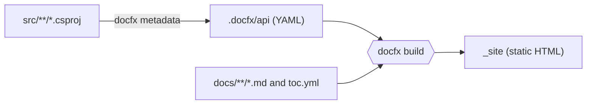

# DocFX

## Overview

DocFX turns Markdown files and the XML documentation comments in C# code into one static website. This repository uses it for two jobs: the
documentation site that you are reading when the site is built, and the API reference for the projects under `src`.

Four concepts cover most of what you need:

| Concept | What it is | Where it lives here |
| --- | --- | --- |
| `docfx.json` | The one configuration file. A `metadata` section says which projects to read, and a `build` section says which files become pages | [docfx.json](../../../docfx.json) |
| Metadata stage | Reads the C# projects with Roslyn and writes one YAML file for each namespace and type | `.docfx/api`, which Git ignores |
| Build stage | Turns Markdown, the YAML files, and a table of contents into HTML | `_site`, which Git ignores |
| Template | The HTML and CSS around every page. The `modern` template adds dark mode, Mermaid diagrams, and math | `"template": ["default", "modern"]` in `docfx.json` |



DocFX is one of the tools that [the documentation system](../../adr/0005-documentation-system.md) rests on. The
[Documentation.Auditor](documentation-auditor.md) checks the pages that DocFX renders, and [Mermaid CLI](mermaid-cli.md) checks the diagrams.

## Decision rationale

[ADR-0005](../../adr/0005-documentation-system.md) compares DocFX with plain Markdown, MkDocs Material, and Docusaurus. DocFX won because it reads
XML documentation from .NET projects itself, so the repository needs no second tool for API reference, and because the `modern` template
renders Mermaid diagrams without a plugin.

| Criterion | What was found |
| --- | --- |
| License | MIT (checked 2026-10-08 on the [repository license](https://github.com/dotnet/docfx/blob/main/LICENSE)) |
| Maintenance | The latest release is 2.81.0 (checked 2026-10-08 on nuget.org), and the project is maintained under the .NET Foundation |
| Cost | The tool is a NuGet package that restores as a local tool, so there is nothing to install by hand |
| Trade-off | DocFX is heavier than a plain Markdown renderer, and its warnings need rules of their own (see the section on how this project uses it) |

## Setup tutorial

**Prerequisites:** the .NET SDK that `global.json` pins, PowerShell 7, and a restored solution.

1. Restore the local tools. The version of DocFX is pinned in `.config/dotnet-tools.json`, and `dotnet tool restore` installs exactly that version.

   ```bash illustrative
   dotnet tool restore
   ```

2. Restore the solution, because the metadata stage builds the projects under `src`.

   ```bash illustrative
   dotnet restore ProductCatalog.slnx
   ```

3. Generate the API metadata. CI runs this step, which is a workflow step, so the lines below are YAML.

   [!code-bash[Generate the API metadata](../../../.github/workflows/docs.yml#docfx-metadata)]

   Expected output: a table that says `DocFX metadata: passed`. While no project under `src` has a public type, the table lists one accepted
   warning, `No .NET API detected`.

4. Build the site. CI runs this step, which is a workflow step, so the lines below are YAML.

   [!code-bash[Build the site](../../../.github/workflows/docs.yml#docfx-build)]

   Expected output: `DocFX build: passed` and `No warnings and no errors.` The site is in `_site`.

5. Look at the site. The `modern` template loads scripts, so open the site through a web server and not as a file.

   ```bash illustrative
   dotnet docfx serve _site
   ```

**Cleanup:** delete the `_site` and `.docfx` folders. Both are build output and Git ignores them.

## How this project uses it

The configuration is [docfx.json](../../../docfx.json), and its choices follow from one rule: every link in a page must resolve, so the build fails
when a page links to a file that does not exist.

- **Pages.** The Markdown under `docs` is the site, and `docs/toc.yml` is the navigation. The files at the repository root, such as the README
  and AGENTS.md, are pages under `/repo/`.
- **Raw files.** Pages link to workflows, policies, scripts, and source files. DocFX only accepts a link to a file it knows, so every other file
  in the repository is copied into `/repo/` as a resource. This is why the globs in `docfx.json` name the hidden folders, such as `.github`, `.config`, and
  `.cspell`, and the files that start with a dot: the pattern `**/*` does not match them. A link to a folder is not a link to a file, so link to a file in it.
- **API reference.** The metadata stage reads `src/**/*.csproj` and writes to `.docfx/api`, and the build maps that folder to `/reference/api`.
  The projects are almost empty until the domain model arrives in WP1.6, so there is nothing to show yet.
- **Warnings are errors.** `tools/ci/Invoke-DocFx.ps1` runs the build with `--warningsAsErrors`. DocFX gives the warning "No .NET API
  detected" no code, so the configuration cannot silence it, and the metadata step accepts exactly that warning and nothing else. The test in
  `tools/ci/DocFx.Tests.ps1` names the exception, so adding another one is a reviewed change. Remove it in WP1.6.
- **Preview.** The `Documentation site` job in [docs.yml](../../../.github/workflows/docs.yml) uploads `_site` as the `docs-preview` artifact for seven days.
  The site is not published yet. GitHub Pages arrives at the Phase 1 exit (WP1.13).
- **Includes.** A tutorial shows a command by including a region of a file that CI runs, with a line such as the two in the setup tutorial.
  DocFX warns about `yaml`, `yml`, and an unknown file extension as snippet languages (checked 2026-10-08), so a workflow region is included with
  `[!code-bash[...](path#name)]`, which finds the `# <name>` and `# </name>` comments in any file that uses `#` for comments.
  The [Documentation.Auditor](documentation-auditor.md) checks that the file and the region exist.

## Validation and troubleshooting

Run the build as in the setup tutorial. A clean build prints `DocFX build: passed`, and the site opens in the browser.

| Symptom | Cause | Fix |
| --- | --- | --- |
| `InvalidFileLink` for a path under `.github` or a file with no extension | The file is not in the content or resource globs of `docfx.json`. The pattern `**/*` skips hidden folders and files that start with a dot | Add an explicit glob for the path, as `docfx.json` does for `.github/**/*` |
| `InvalidFileLink` for a template page | Templates are not content, so a page that links to one needs the template as a resource | Keep `docs/templates` in the resource list of `docfx.json` |
| "No .NET API detected" fails the build | The step ran without the script, so nothing accepts the warning | Run `tools/ci/Invoke-DocFx.ps1`, which accepts exactly this warning |
| The metadata step cannot find packages | The metadata stage does not restore (`noRestore` is on in `docfx.json`) | Run `dotnet restore ProductCatalog.slnx` first |
| A diagram shows its source text | Mermaid works only in the `modern` template | Keep `"modern"` in the `template` list |

## Security and operations

- **Pin.** DocFX is a local tool with an exact version and `rollForward` turned off in `.config/dotnet-tools.json`. NuGet requires a repository
  signature on every package ([ADR-0020](../../adr/0020-dependency-intake-controls.md)), and the restore passed that check for 2.81.0.
- **Access.** The job has a read-only token and no secrets. The build reads the repository and writes `_site`, so a compromised DocFX could
  change the preview artifact but nothing else.
- **Publication.** The site contains a copy of every repository file under `/repo/`. The repository is public, and secrets are never committed,
  so the copy adds nothing, but a file that must not be published must not be in the repository.
- **Updates.** A new DocFX version is a change to `.config/dotnet-tools.json` and to the inventory entry, and the
  [Documentation.Auditor](documentation-auditor.md) fails when the two disagree.

## Lab

None yet. The eight Phase 1 labs arrive in WP1.13, and none of them is about the documentation toolchain.

## Further research

- [DocFX documentation](https://dotnet.github.io/docfx/): the official guide and reference (checked 2026-10-08)
- [The docfx.json reference](https://dotnet.github.io/docfx/reference/docfx-json-reference.html): every setting, including file mappings and `rules` (checked 2026-10-08)
- [.NET API docs](https://dotnet.github.io/docfx/docs/dotnet-api-docs.html): the metadata and build stages (checked 2026-10-08)
- [Markdown in DocFX](https://dotnet.github.io/docfx/docs/markdown.html): includes, code snippets, alerts, and Mermaid (checked 2026-10-08)
- [Templates](https://dotnet.github.io/docfx/docs/template.html): the modern template and how to customize it (checked 2026-10-08)
- [Diataxis](https://diataxis.fr/): the structure that the site follows (checked 2026-10-08)
