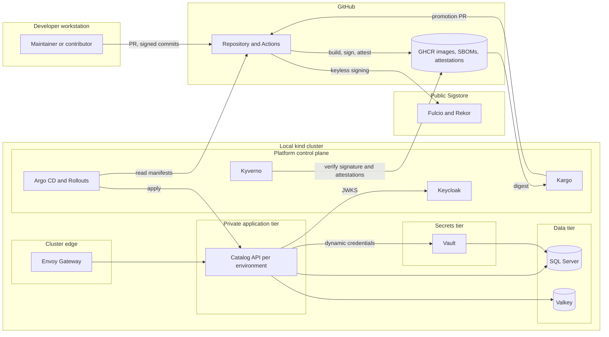

# Threat model

**Status: version 1, written in Phase 0 and updated in WP1.1.** This model describes the *planned* system. A control is delivered only when the
Delivered column says so, and every other control names the phase that delivers it. Each phase updates it, and Phase 4 finalizes it. A work package
that changes a trust boundary, a data flow, or a credential must update this page (Definition of Done item 7 in [CONTRIBUTING.md](../../CONTRIBUTING.md)).

The method is STRIDE per trust boundary: Spoofing, Tampering, Repudiation, Information disclosure, Denial of service, and Elevation of privilege.
Start a new boundary from [the entry template](../templates/threat-model-entry-template.md).

## System context

## Assets

| Asset | Why it matters | Where it lives | Planned protection |
| --- | --- | --- | --- |
| Source code, history, and plan | Integrity of everything built from it | GitHub | Rulesets, review, signed commits recommended, secret scanning |
| Workflow definitions and tokens | Control over build, signing, and publishing | GitHub Actions | Pinned actions, least-privilege tokens, protected environments |
| Published images, SBOMs, provenance, signatures | What the cluster runs and what users trust | GHCR and public transparency logs | Digests, attestations, keyless signatures, admission verification |
| Product catalog data | The application's business data | SQL Server | Private tier, TLS, per-workload credentials, backups |
| Runtime credentials | Access to data and cache | Vault, delivered to pods | Short-lived leases, revocation, memory-backed files |
| Vault unseal keys and root token | Total control of the secrets tier | Operator custody, outside the repository | Documented custody, root token revoked after bootstrap |
| GitHub App private keys | Ability to open and merge promotion pull requests | Vault, synced only to Kargo | Single-repository scope, minimum permissions |
| Signing identity | Trust that an image came from this repository's trusted workflow | Fulcio certificate bound to workflow identity | Policy pins the exact identity and issuer |
| Cluster administration | Control of the platform | Local kubeconfig | Disposable environments, no copy between machines |
| Local certificate authority key | Ability to mint trusted certificates for the platform | Cluster secret | Scoped issuers, local-only trust |
| Identity tokens | Access to the API and platform UIs | Keycloak | Short lifetimes, audience and issuer checks |
| Telemetry | Can leak personal or sensitive data | Collector, Prometheus, Tempo, Loki | Redaction, no secrets or personal data in logs |

## Actors

| Actor | Capability assumed |
| --- | --- |
| Anonymous internet user | Reads the public repository, opens Issues and Discussions, forks, and opens pull requests from forks |
| External contributor | Submits fork pull requests that run workflows with a read-only token |
| Maintainer | Full administrative access; the only reviewer |
| Compromised dependency or action | Runs inside CI or the application with that component's privileges |
| Compromised developer workstation | Everything the maintainer's session can reach, including the local cluster |
| Malicious or vulnerable container image | Code running in a pod |
| Co-tenant workload | A pod in another namespace on the same cluster |
| Authorized API client | Calls the API within its scopes |
| Unauthorized API client | Calls the API without a valid token, or with the wrong scopes |
| AI assistant | Acts with the maintainer's tools; can be misled by untrusted text in Issues, pull requests, or web pages |

## Trust boundaries and initial threats

Controls are marked with the phase and work package that deliver them. Only the controls whose Delivered column says *delivered* exist today. The rest are *planned*.

### TB1: Developer workstation to GitHub

| Threat | Category | Control | Delivered |
| --- | --- | --- | --- |
| A stolen maintainer credential pushes malicious code | Spoofing, Tampering | Required pull requests and checks, CODEOWNERS on sensitive paths, signed commits recommended | Phase 0 (WP0.7) |
| Secrets or personal data are committed | Information disclosure | gitleaks over full history, push protection, secret scanning, privacy rules in [ADR-0006](../adr/0006-commit-identity-and-privacy.md) | Phase 0 (WP0.6, WP0.7) |
| An AI assistant is steered by untrusted text into a harmful action | Tampering, Elevation of privilege | Agent rules, read-only skill scopes, no write tokens on untrusted input, review checklist | Phase 0 (WP0.5) |

### TB2: GitHub build, publish, and dependency intake

| Threat | Category | Control | Delivered |
| --- | --- | --- | --- |
| A third-party action or tool is compromised, as with tj-actions in 2025 and trivy-action in 2026 | Tampering | SHA pinning enforced by policy, immutable releases, minimal third-party actions, zizmor, least-privilege tokens | Phase 0 settings, enforced in Phase 2 (WP2.2) |
| A fork pull request exfiltrates a token or tampers with publishing | Information disclosure, Tampering | Approval for outside contributors, read-only default token, no `pull_request_target` that runs pull request code, publish only from `master` and tags through protected environments | Phase 0 settings, Phase 2 (WP2.2) |
| An artifact is swapped between jobs or in the registry | Tampering | One build per commit identified by digest, attestations bound to the digest, a verification job, admission verification | Phase 2 (WP2.4, WP2.5), Phase 3 (WP3.6) |
| A vulnerable or non-compliant dependency enters | Tampering, Elevation of privilege | Central package versions with transitive pinning, lock files with a locked restore in CI, package source mapping, required nuget.org repository signatures, NuGet audit with warnings as errors, a license allow-list gate, a forbidden-package list, and Dependabot with a cooldown. Dependency review follows in Phase 2 ([ADR-0020](../adr/0020-dependency-intake-controls.md)) | Phase 0 (Dependabot); WP1.1 delivered the rest of the intake controls on 2026-10-08; Phase 2 (WP2.3) adds dependency review |
| A trusted signing certificate expires, or a trusted signer is wrongly added | Spoofing, Tampering | The three nuget.org repository certificates are copied from the service's own endpoint, the newest expires on 2027-05-18 and `NuGet.config` says to re-read the endpoint before then, and a wrong fingerprint was shown to fail the restore (`NU3034`) | WP1.1 delivered 2026-10-08 |
| Pull request code runs on a CI runner during restore, build, and tests | Elevation of privilege, Information disclosure | The `ci` workflow uses `permissions: {}` with `contents: read` per job, `persist-credentials: false`, no secrets, no publishing, and a pull-request title that reaches scripts only through an environment variable. Outside-contributor approval is a repository setting | WP1.1 delivered 2026-10-08; Phase 2 (WP2.2) hardens it further |
| Testcontainers gives a test dependency control of the Docker daemon on a runner or workstation | Elevation of privilege | The reaper runs privileged with the Docker socket by default ([spike 1.d](../research/spikes/1.d-testcontainers-mssql.md)), so the first CI job that starts containers must run on an ephemeral hosted runner and use the digest-pinned reaper image | Planned, WP1.8 |
| Nobody can show who built what | Repudiation | Provenance, signatures, and public transparency-log entries per release | Phase 2 (WP2.5) |

### TB3: Public Sigstore

| Threat | Category | Control | Delivered |
| --- | --- | --- | --- |
| Signing publishes workflow identity, ref, commit, and run link to a public log | Information disclosure | Accepted because the repository is public ([ADR-0002](../adr/0002-repository-visibility-and-capability-strategy.md), [ADR-0013](../adr/0013-shift-left-security-toolchain.md)); a lab shows exactly which fields are exposed | Phase 2 (WP2.5) |
| A signature from the wrong identity is accepted | Spoofing | The admission policy pins the exact workflow identity and issuer | Phase 2 (WP2.0), Phase 3 (WP3.6) |

### TB4: Cluster edge

| Threat | Category | Control | Delivered |
| --- | --- | --- | --- |
| Unauthenticated or wrongly scoped API calls | Spoofing, Elevation of privilege | JWT validation with exact issuer and audience, policy-based authorization, denied-path tests | Phase 1 (WP1.7, WP1.10) |
| Request floods | Denial of service | Request limits, rate limiting, gateway limits, resource quotas | Phase 1 (WP1.10), Phase 3 (WP3.2) |
| Forged forwarded headers | Spoofing | Explicit known-proxy configuration and a test | Phase 1 (WP1.10), Phase 3 (WP3.2) |
| Management or health endpoints exposed | Information disclosure | Management port that the gateway never routes | Phase 1 (WP1.10), Phase 3 (WP3.2) |
| Traffic is read between gateway and API | Information disclosure | Re-encrypted upstream traffic with BackendTLSPolicy | Phase 3 (WP3.2) |

### TB5: Private application tier

| Threat | Category | Control | Delivered |
| --- | --- | --- | --- |
| A compromised pod moves laterally | Elevation of privilege | Default-deny NetworkPolicies, restricted Pod Security, non-root, read-only root filesystem, dropped capabilities | Phase 3 (WP3.2, WP3.6) |
| Over-broad RBAC | Elevation of privilege | Dedicated service accounts and least-privilege roles | Phase 3 (WP3.2) |
| Long-lived credentials are stolen and reused | Information disclosure | Short-lived leases delivered to memory-backed files | Phase 3 (WP3.3, WP3.4) |
| Authorization bypass | Elevation of privilege | Authorization at endpoints and at the use-case boundary, tested exhaustively | Phase 1 (WP1.7, WP1.10) |

### TB6: Data tier

| Threat | Category | Control | Delivered |
| --- | --- | --- | --- |
| Direct access from another namespace or environment | Elevation of privilege | NetworkPolicy, cluster-internal services only, a policy that forbids external services in the data namespace | Phase 3 (WP3.2, WP3.4, WP3.6) |
| Credential theft or reuse | Information disclosure | Per-workload dynamic credentials with revocation that ends sessions, and TLS | Phase 3 (WP3.4) |
| Cross-environment cache access or poisoning | Tampering | Per-environment ACL users limited to their key prefix and channels, TLS | Phase 1 (WP1.9), Phase 3 (WP3.4) |
| SQL injection | Tampering | Parameterized queries through EF Core and input validation | Phase 1 (WP1.8, WP1.10) |
| Data loss | Denial of service | Backup job and a rehearsed restore | Phase 3 (WP3.4) |

### TB7: Secrets tier

| Threat | Category | Control | Delivered |
| --- | --- | --- | --- |
| Vault compromise exposes every secret | Information disclosure | Operator custody of unseal keys, audit device, narrow policies, network isolation, root token revoked after bootstrap | Phase 3 (WP3.3) |
| A GitHub OIDC token is replayed from another repository or ref | Spoofing | Bound claims for repository, workflow, ref, event, and audience, with a negative test | Phase 3 (WP3.3) |
| Unregistered trust anchors | Elevation of privilege | A trust-anchor register with custody, scope, rotation, and break-glass for each | Phase 3 (WP3.3) |

### TB8: Platform control plane

| Threat | Category | Control | Delivered |
| --- | --- | --- | --- |
| A malicious manifest is merged and deployed | Tampering | Pull request review, CODEOWNERS on production overlays, admission verification, restricted AppProjects | Phase 3 (WP3.6), Phase 4 (WP4.3) |
| Abuse of the promotion bot | Elevation of privilege | A single-repository GitHub App with minimum permissions, its key in Vault, and a human merge for production | Phase 4 (WP4.5) |
| Policy bypass | Elevation of privilege | Scoped, documented exceptions, Audit before Enforce, documented break-glass | Phase 3 (WP3.6) |
| Terraform state exposes secrets | Information disclosure | Secret-free local state for the cluster, no secret values in state | Phase 3 (WP3.1) |
| Platform UIs and APIs are exposed | Spoofing | Single sign-on through Keycloak and local admin accounts disabled after bootstrap | Phase 3 (WP3.5), Phase 4 (WP4.3) |

## Residual and accepted risks

- **A compromised workstation can reach the local cluster.** The cluster is disposable and holds only synthetic data, but the host is part of the trust base.
- **Standard NetworkPolicy cannot filter egress by hostname.** Internet egress is limited to a few controllers on port 443. Cilium is the documented upgrade path.
- **Vault is licensed under the BSL.** It is used only as a tool ([ADR-0004](../adr/0004-licensing-and-dependency-license-policy.md)).
- **Public transparency logs record signing metadata** ([ADR-0013](../adr/0013-shift-left-security-toolchain.md)).
- **One maintainer.** Review is partly automated, and every bypass is recorded ([ADR-0007](../adr/0007-solo-maintainer-governance.md)).
- **The replaced initial commit may stay retrievable by its ID** ([ADR-0006](../adr/0006-commit-identity-and-privacy.md)).

## Assumptions

- The maintainer's GitHub account uses two-factor authentication.
- GitHub, Sigstore, and the cloud registries that host pinned images are trusted within their documented guarantees.
- Demonstration credentials are generated locally, are disposable, and are never reused.

## Open questions

- Whether Vault's Redis plugin can issue dynamic Valkey credentials, or rotated static ACL users are used instead (spike in WP3.0).
- How much of the scrape and trace pipeline needs mutual TLS inside the cluster (decided in WP3.7).
- Which controls move from advisory to blocking once the Kyverno policies leave Audit mode (WP3.6).

## How to update this model

1. Add or change the entry for the affected boundary, with the control and the test or evidence.
2. Change a control's *Delivered* column only when the work package that builds it has merged.
3. Add residual risks when a control is deferred, with the reason and the owner.
4. Record the change in the pull request description.
