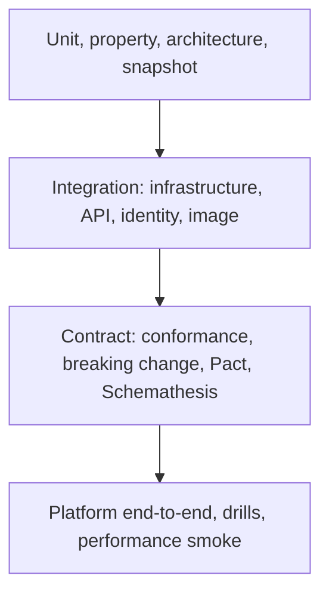

# Testing strategy

Testing is part of the architecture here, not a phase at the end. Every requirement is linked to a test or to explicit evidence, every phase
publishes a test plan, and the thresholds are numbers, not intentions. The tool choices and their evidence are in
[ADR-0018](../adr/0018-test-stack-and-quality-gates.md). The authoritative thresholds and rules are in section 10 of
[the implementation plan](../plans/implementation-plan.md).

## Principles

1. **Risk decides depth.** Domain invariants, authorization, data integrity, and credential handling get the deepest tests. Glue code gets less.
2. **Real dependencies for integration.** SQL Server, Valkey, and Keycloak run in Testcontainers. Mocks hide the failures that matter.
3. **Fast feedback first.** A typical pull request gets feedback within 15 minutes, because blast-radius analysis selects the jobs it needs.
   The comprehensive suite runs nightly.
4. **Negative paths are tests too.** Denied authorization, stale and missing concurrency headers, replayed idempotency keys, dependency outages, and
   rotated credentials each have a case.
5. **Deterministic or deleted.** A flaky test is quarantined within a day and fixed or removed within seven.

## The suites



| Layer | Suites | What they prove |
| --- | --- | --- |
| Unit | Domain and application tests, property tests, architecture rules, snapshots | Invariants, handlers, validators, decorators, layer boundaries, and that served documents and error shapes do not change by accident |
| Integration | Infrastructure, API, identity contract, image tests | Persistence, migrations, the outbox, idempotency, cache invalidation across nodes, HTTP semantics, the authorization matrix, the real Keycloak realm, and the container's properties |
| Contract | OpenAPI conformance, breaking-change check, Pact, Schemathesis | The served API matches the authored contract, consumers keep working, and generated inputs do not break the API |
| Platform | Chainsaw probes, `kyverno test`, `terraform test`, rollback and failure drills | Network segmentation, admission policy, infrastructure modules, and recovery procedures |
| Quality | Mutation testing, k6 performance, documentation and onboarding checks | Test strength, SLO thresholds, and that a stranger can run the project |

The per-phase tables of suites, gates, and evidence are in each [phase plan](../plans/phases/phase-1-api-core.md).

## Traceability from requirement to evidence

Every requirement has an ID of the form `REQ-<AREA>-<NNN>`. A test declares which requirement it proves, and a generated report fails when an
in-scope requirement has no test or evidence.

- **.NET tests** carry a trait:

  ```csharp
  [Fact]
  [Trait("Requirement", "REQ-DATA-004")]
  public async Task Reusing_an_idempotency_key_with_a_different_payload_returns_422()
  ```

- **Other tests** (Chainsaw, Kyverno, k6, Pester, Terraform) declare IDs in a comment line that the auditor reads, for example
  `# requirements: REQ-QUA-004, REQ-QUA-005` (use `//` in a k6 file).
- **Manual drills and documents** record their proof in a file, and an entry in [the evidence register](evidence.yaml) names the
  requirements it proves.
- `governance trace` generates [the traceability report](traceability.md), which maps requirements to tests to evidence. It fails when a
  requirement that is in scope has neither, and `governance trace --check` fails when the committed report is out of date
  ([ADR-0022](../adr/0022-generated-status-and-traceability.md)). A requirement is in scope once every work package that delivers it is
  completed, or when its status is `verified`.

The requirement list starts in [the brief traceability table](../requirements/brief-traceability.md).

## Determinism rules

- Time comes from `FakeTimeProvider` and identifiers from an injected generator, never from the system clock or `Guid.NewGuid()` in tests.
- Tests run under the invariant culture. Property-test seeds are logged so a failure can be replayed.
- Container images are pinned by digest. Containers are shared through assembly fixtures and started once per test assembly.
- No test depends on the order of other tests. Parallelism is declared per assembly, in the `xunit.runner.json` of each test project.
- Test data comes from builders and synthetic data, never from real people or production.

Two checks keep these rules from eroding. A test fails when a test project lacks `xunit.runner.json`, and `tests/Directory.Build.props`
sets the invariant culture for every test project. WP1.1 also found a rule-evaluation cache that made two tests depend on run order, so
shared caches in a test tool are switched off, and each suite runs in both Debug and Release before it is trusted.

## Quality thresholds

The initial values are in plan section 10.4 and in the ADR: line coverage of at least 90 percent for the domain and 85 percent for the application layer,
80 percent across the solution, branch coverage of at least 80 percent for the domain and the application layer, a domain mutation score of at least
70 percent once the mutation runner is generally available, zero analyzer warnings, zero documentation warnings, and the k6 thresholds from the
service-level objectives. Changing a threshold needs an ADR.

The numbers are enforced from `governance/policies/coverage-thresholds.json` by `tools/ci/Test-CoverageThresholds.ps1`, which CI runs after the tests.
An assembly that contains code but has no coverage data fails the check, so "not measured" never reads as "covered". An exemption names its reason
and the work package that ends it. The composition root is exempt until WP1.10.

## What a test case records

Every case in a phase test plan records its purpose, preconditions, where it is automated, the expected result, how to diagnose a failure,
and the evidence it leaves. Start from [the test plan template](../templates/test-plan-template.md).

## Reports and evidence

CI publishes bounded, machine-readable reports (test results, coverage, scan output) and a readable summary on each run. Releases from `v0.2.0` on carry an
evidence bundle: test reports, coverage, SBOMs, scan results, and verification transcripts. [The status page](../project/STATUS.md) links the evidence for
each completed work package.

## Where tests run

| Where | What runs |
| --- | --- |
| Local, through the `dev` command (from WP1.4) | Any suite, with the same containers as CI. Until then, the commands in [AGENTS.md](../../AGENTS.md) |
| Pull request CI | The `ci` workflow: restore from lock files, build with warnings as errors, the unit and architecture tests with coverage, the coverage thresholds, the script tests, the format check, the license gate, and the pull-request title check. The `governance` workflow: the status files, the generated pages, requirements traceability, the security auditor, and the blast-radius evaluator. The `docs` workflow: Markdown style, relative links and anchors, spelling, Mermaid diagrams, the documentation site build with warnings as errors, the documentation auditor, and a full-history secret scan. All three workflows still run every job. The blast-radius outputs that select jobs are published by the `governance` workflow, and the selection arrives with WP2.2 |
| `master` and nightly | The comprehensive suites, mutation, the external link check (the `docs` workflow runs it nightly), image re-scans |
| Release | Performance, onboarding, rollback drills, and every gate above |

Phase 0 has no application code, so its tests are checks on content, history, and settings. They are listed in the
[Phase 0 test plan](../plans/phases/phase-0-foundation.md). Phase 1 starts the code suites. WP1.1 delivers the architecture, reference, and
dependency tests in `tests/Catalog.Architecture.Tests`, WP1.2 delivers the tests of the governance tool in
`tests/Governance.Auditor.Tests`, and WP1.3 delivers the tests of the documentation auditor in `tests/Documentation.Auditor.Tests`, with the
Pester tests of the DocFX wrapper in `tools/ci`. The unit, integration, snapshot, and API suites arrive with the work packages that
build the code they test.
